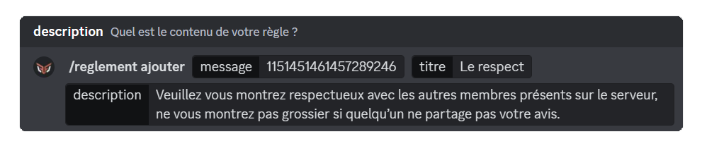
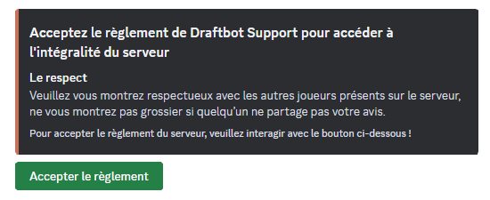
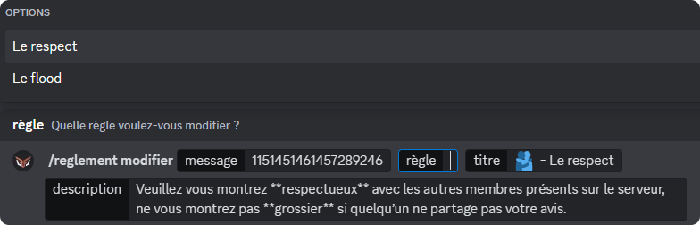
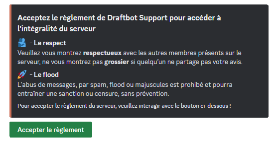
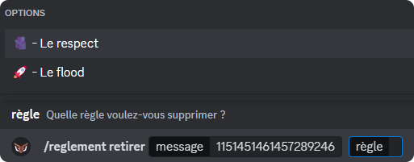

# 📝 Règlement

## Création du règlement

Pour commencez, vous allez devoir effectuer la commande <mark style="color:orange;">/reglement créer</mark>. **DraftBot** vous donnera ensuite la possibilité d'ajouter le rôle que vous souhaitez attribuer aux membres, une fois qu'ils ont pris connaissance du règlement et qu'ils ont cliqué sur le bouton "<mark style="color:green;">Accepter le règlement</mark>".

## Ajouter des règles

Maintenant que l'embed a été créé, vous aurez besoin d'ajouter des règles afin de conserver une bonne stabilité dans votre communauté. Pour cela, vous allez utiliser la commande <mark style="color:orange;">/reglement ajouter</mark>, DraftBot vous demandera : le message du règlement, le titre et la description de votre règle.


Pour le message du règlement, il s'agit de récupérer **l'identifiant** de l'embed du règlement que vous avez créé.
Pour savoir comment récupérer un identifiant : [Cliquez ici !](../../autres/recuperer-un-identifiant.md#message)



Lorsque l'ajout d'une règle est effectuée, **DraftBot** proposera deux choix : ajouter une autre règle ou de remettre à plus tard.



 Le titre est limité à 256 caractères, tandis que la description est limitée à 1 024 caractères. 

## Modifier les règles

Vous pouvez modifier vos règles à tout moment, que se soit pour faire une correction ou bien pour le rendre plus esthétique selon vos envies. Vous aurez besoin de la commande <mark style="color:orange;">/reglement modifier</mark>. La procédure n'est pas très différente de la commande <mark style="color:orange;">/reglement ajouter</mark>, juste qu'un nouveau champ apparaît : **"règle"**.

Ce champ vous permet de sélectionner **la règle** que vous souhaitez modifier.

## Retirer les règles

Si une règle ne vous plaît pas et que vous souhaitez la retirer, vous pouvez utiliser la commande <mark style="color:orange;">/reglement retirer</mark>. Vous aurez juste à récupérer **l'identifiant** du message du règlement et sélectionner la **règle**.

