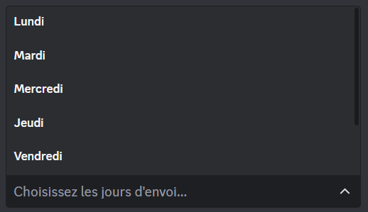
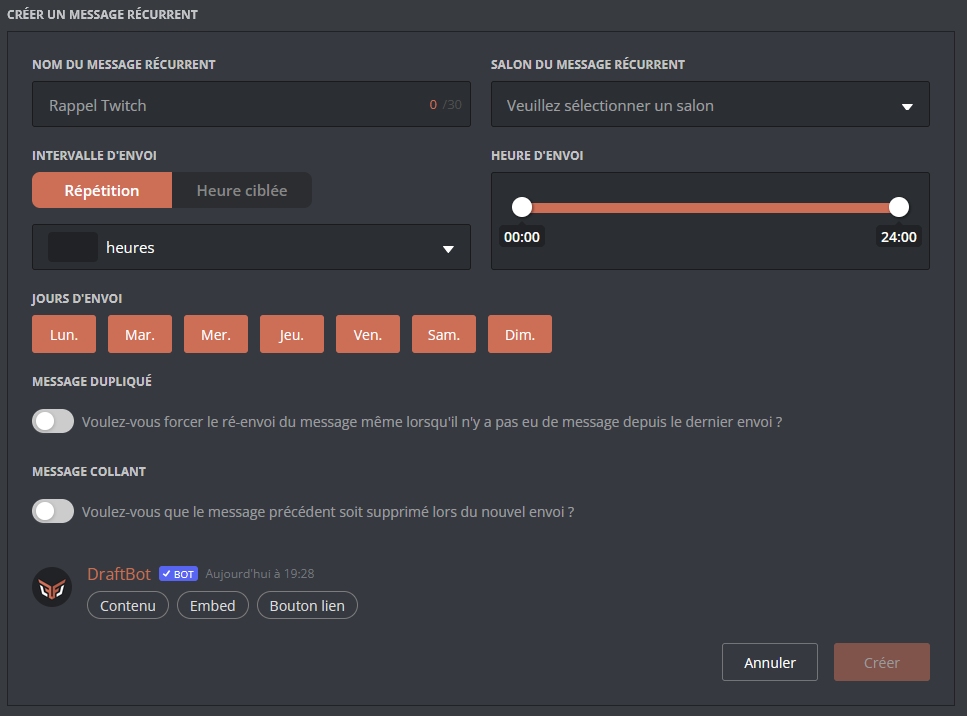

# 🔔 Messages récurrents

## Configurer un message récurrent



## <mark style="color:blue;">Nommer votre message</mark>

La première chose à faire sera de nommer votre message ! Pour chaque question il suffira d'écrire sous le message de DraftBot pour y répondre. *(Si vous souhaitez annulé entrer ``"cancel"``)*

## <mark style="color:blue;">Sélectionner l'intervalle d'envoie</mark>

Vous devez sélectionner le type d'intervalle pour l'envoie. *(<mark style="color:blue;">[Voir la référance ici](repeat-messages#intervalle-denvoi)</mark>)*

## <mark style="color:blue;">Heures/Jours d'envoie</mark>

- Vous devez sélectionner le type d'intervalle pour l'envoie **"Répétition"** ou **"Heure ciblée"**.

***Répétition/Relatif** : Envoie du message à une certaine récurrence.*
***Heure ciblée/Ciblé** : Envoie du message à un jour et une heure ciblée.*


*L'heure est basée sur le fuseau horaire français.*


- Par la suite, vous avez le choix de sélectionner les jours où le message récurrent pourrait être envoyé avec un menu déroulant.

## <mark style="color:blue;">Créer votre message</mark>

Vous êtes rendu à la création de votre message ! N'hésiter pas à utiliser le [Markdown](https://support.discord.com/hc/en-us/articles/210298617-Markdown-Text-101-Chat-Formatting-Bold-Italic-Underline)


Nous vous conseillons d'utiliser le <mark style="color:blue;">[panel de DraftBot](https://www.draftbot.fr/dashboard/user)</mark> pour accèder à plus de fonctionnalité.


## <mark style="color:blue;">Sélectionné le salon d'envoie</mark>

Par la suite, vous devrez sélectionné le salon dans lequel sera envoyé le message.

## <mark style="color:blue;">WIP</mark>

- WIP fontion





## <mark style="color:blue;">L'interface du panel</mark>

Le panel vous offres énormément de possibilité il est normal d'être quelque peut désorienter.




## Message collant

Permet que le message précédent soit supprimé lors du nouvel envoi.

## Message dupliqué *(Avantage <mark style="color:orange;">premium</mark> ✨)*

Message collant est une option qui permet de forcer le ré-envoi du message même lorsqu'il n'y a pas eu de message depuis le dernier envoi.