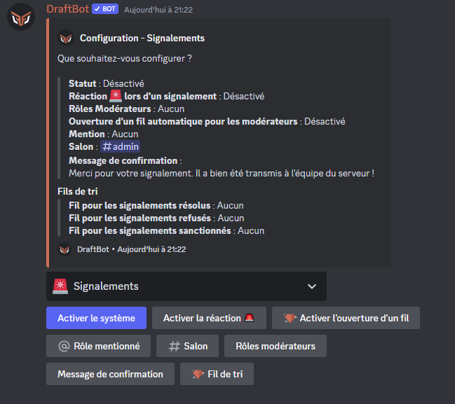
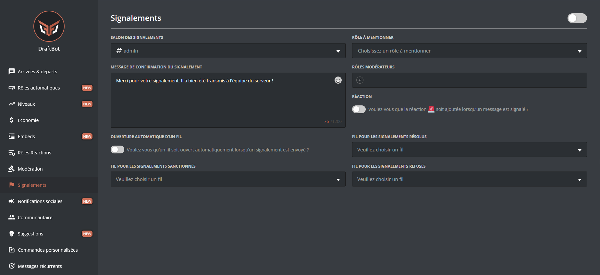
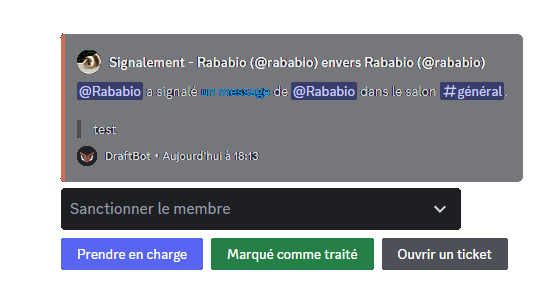

# 🚨 Signalements

## Configuration



Vous trouverez ci-dessous la configuration des signalements avec la commande <mark style="color:orange;">/config</mark> :

Veuillez d'abord vous rendre dans la commande <mark style="color:orange;">/config</mark> ➜ 🚨 Signalements

Voici les différents boutons ainsi que leurs utilités :
- <mark style="color:blue;">"Activer le système"</mark> ➜ Permet d'activer ou désactiver le système.
- "Activer la réaction 🚨" ➜ DraftBot réagira au message signalé avec la réaction "🚨".

- "Activer l'ouverture d'un fil" ➜ Si activé, DraftBot ouvrira un fil pour les modérateurs quand un signalement est envoyé. **_([✨ premium](https://draftbot.fr/premium))_**
- "Rôle mentionné" ➜ Permet de définir le rôle qui sera mentionné dans le message de signalement.
- "<mark style="color:blue;">Salon</mark>" ➜ Défini le salon dans lequel le message de signalement est envoyé.
- "Rôles Modérateurs" ➜ Permet de définir des rôles non-administrateurs qui pourront gérer les signalements.
- "Message de confirmation" ➜ Défini le message qui sera envoyé à la personne qui fait le signalement.

Variables

Les variables sont des bouts de texte qui évoluent suivant la personne, le serveur, le salon ou encore le temps. Voici celles utilisables dans les motifs de signalement de DraftBot.

- `{user}` ➜ Mention du membre
- `{user.id}` ➜ Identifiant du membre
- `{user.username}` ➜ Pseudo du membre
- `{user.nickname}` ➜ Surnom ou pseudo du membre
- `{server}` ➜ Nom du serveur
- `{server.id}` ➜ Identifiant du serveur
- `{server.name}` ➜ Nom du serveur
- `{server.membercount}` ➜ Nombre de membres sur le serveur
- `{channel}` ➜ Mentions du salon
- `{channel.id}` ➜ Identifiant du salon
- `{channel.name}` ➜ Nom du salon
- `{date}` ➜ Date actuelle (JJ/MM/AAAA)
- `{time}` ➜ Heure actuelle (HH:MM)
- `{timestamp}` ➜ Timestamp actuel en secondes


Votre message peut faire au maximum 1 200 caractères.


- Fil de tri  ➜ Permet de définir les fils pour les signalements résolus, refusés et sanctionnés pour les modérateurs. **_([✨ premium](https://draftbot.fr/premium))_**



<mark style="color:blue;">[Accéder au panel de **DraftBot**](https://draftbot.fr/dashboard)</mark>

Sur le panel, vous retrouverez sur une même page, les mêmes possibilités de configuration qu'avec les commandes Slash sur Discord.

Pour configurer le système de signalements, accédez au panel via le lien ci-dessus et rendez-vous dans la catégorie "Signalements" sur le serveur de votre choix.

> ⚠️ Une fois que vous avez fini, n'oubliez pas d'enregistrer vos modifications avec le bouton "Enregistrer" en bas de la page.




## Gestion des signalements

Une fois qu'une personne aura signalé un utilisateur ou un message, vous aurez ce message dans le salon que vous aurez défini auparavant :

<!--A changer : faute d'orthographe dans le message-->

Vous aurez alors différentes possibilités :

"<mark style="color:blue;">Prendre en charge</mark>" ➜ Permet de montrer que vous êtes en train de régler le signalement.

"<mark style="color:green;">Marquer comme traité</mark>" ➜ Marque le signalement comme résolu.
Vous pouvez ensuite séléctionner la raison de la résolution du signalement parmis :
<mark style="color:blue;">Membre sanctionné</mark>, <mark style="color:green;">Signalement résolu</mark> et <mark style="color:blue;">Signalement refusé</mark>.
Une fois la raison sélectionnée, vous pourrez ajouter un commentaire facultatif.

"Ouvrir un ticket" ➜ Permet d'ouvrir un ticket pour le membre pour le <mark style="color:red;">membre accusé</mark> ou le <mark style="color:blue;">membre signalant</mark> (disponible uniquement si le système de tickets est activé).

"Sanctionner le membre" ➜ Permet de sanctionner le membre signalé avec une sanction prédéfinie (disponible uniquement si des sanctions prédéfinies sont enregistrées).


Vous pourrez toujours remettre le signalement en attente via le bouton sur le message de signalement.
