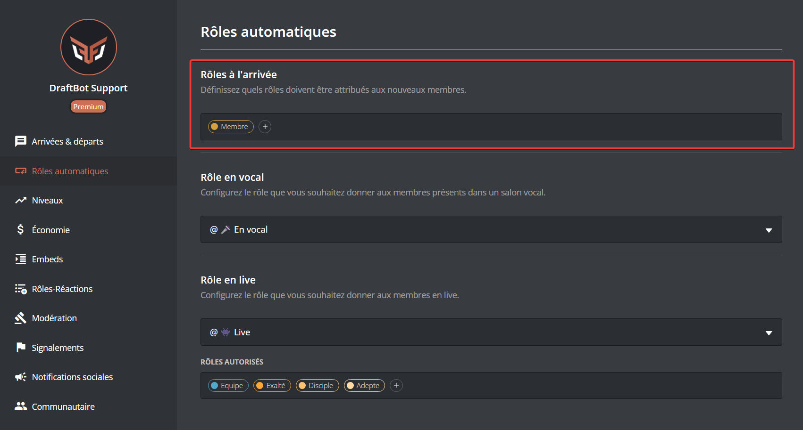
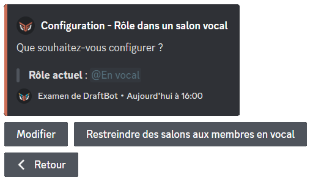
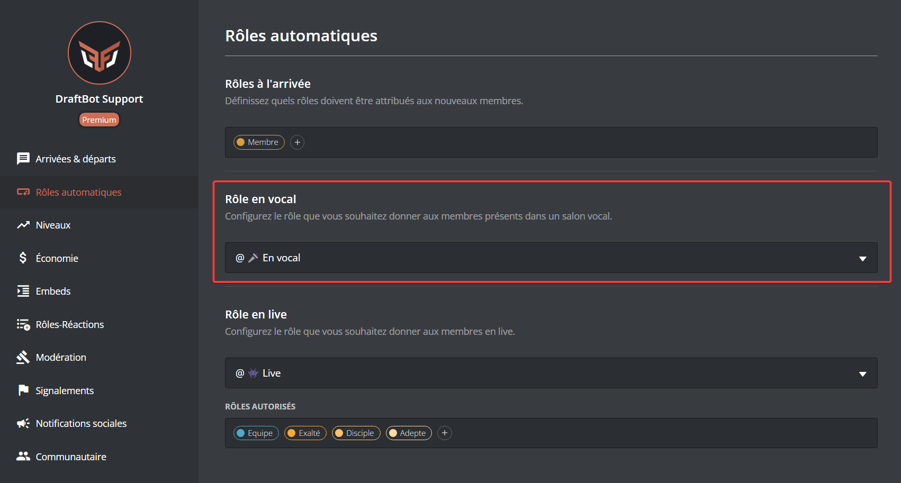

# 🏷 Rôles automatiques

## A l'arrivée



Veuillez d'abord vous rendre dans <mark style="color:orange;">/config</mark> ➜ 🏷️ Rôles automatiques ➜ <mark style="color:blue;">"À l'arrivée"</mark>.

Pour ajouter un rôle automatique lorsqu'un membre rejoint votre serveur, cliquez sur "Ajouter".

Si vous souhaitez retirer un rôle de cette liste, cliquez sur "Retirer".

Pour retirer **tous** les rôles automatiques, cliquez sur "Réinitialiser".


La limite des rôles automatiques est de 3 pour les serveurs non-premiums et de 10 pour les serveurs premiums.





Veuillez d'abord vous rendre sur le <mark style="color:blue;">[panel](https://draftbot.fr/dashboard/user/)</mark> ➜ Rôles automatiques.

Sélectionnez ensuite le rôle que vous souhaitez rendre automatique à l'arrivée d'un nouveau membre.


Certains rôles peuvent apparaitre en rouge pour l'une des raisons suivantes :\
➜ DraftBot n'a pas les permissions de gérer les rôles.\
➜ Le rôle de DraftBot est en dessous des rôles que vous souhaitez attribuer.\
➜ Le rôle de l'utilisateur est en dessous des rôles qu'il souhaite attribuer.\
➜ Le rôle est géré par un bot ou par Discord.





## En vocal



Veuillez d'abord vous rendre dans <mark style="color:orange;">/config</mark> ➜ 🏷️ Rôles Automatiques ➜ <mark style="color:blue;">"En vocal"</mark>.

Pour ajouter un rôle automatique à un membre en vocal, vous pouvez cliquer sur **"Configurer"**.


Vous avez la possibilité de sélectionner un rôle déjà existant ou d'en créer un directement.


Pour retirer un rôle automatique à l'arrivée d'un membre, vous pouvez cliquer sur **"Modifier"**.


 Vous avez la possibilité de supprimer le rôle du serveur une fois le système désactivé.


### Restreindre des salons aux membres en vocal

Pour restreindre des salons aux membres en vocal, cliquez sur **"Restreindre des salons aux membres en vocal"** puis sélectionnez le salon en question. Seuls les membres possédant ce rôle pourront le voir.




Veuillez d'abord vous rendre sur le <mark style="color:blue;">[panel](https://draftbot.fr/dashboard/user/)</mark> ➜ Rôles automatiques.

Sélectionnez ensuite le rôle que vous souhaitez rendre automatique lorsqu'un membre rejoint un salon vocal.


Certains rôles peuvent apparaitre en rouge pour l'une des raisons suivantes :\
➜ DraftBot n'a pas les permissions de gérer les rôles.\
➜ Le rôle de DraftBot est en dessous des rôles que vous souhaitez attribuer.\
➜ Le rôle de l'utilisateur est en dessous des rôles qu'il souhaite attribuer.\
➜ Le rôle est géré par un bot ou par Discord.



