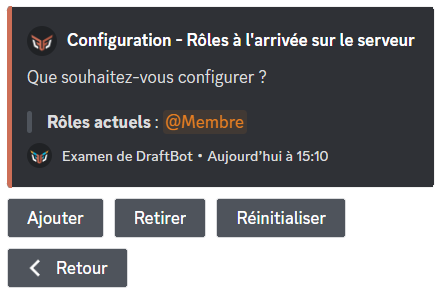
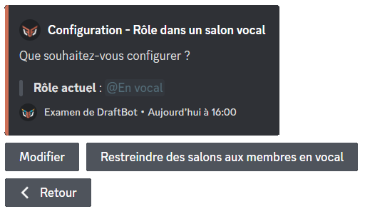
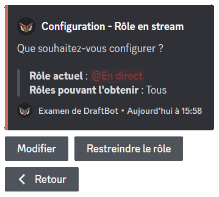

# 🏷 Rôles automatiques

## A l'arrivée



Veuillez d'abord vous rendre dans <mark style="color:orange;">/config</mark> ➜ 🏷️ Rôles automatiques ➜ <mark style="color:blue;">"À l'arrivée"</mark>.

Pour ajouter un rôle automatique lorsqu'un membre rejoint votre serveur, cliquez sur "Ajouter".

Si souhaitez retirer un rôle de cette liste, cliquez sur "Retirer".

Pour retirer **tous** les rôles automatiques, cliquez sur "Réinitialiser".

ㅤ


La limite des rôles automatiques est de 3 pour les serveurs non-premiums et de 10 pour les serveurs premiums.


ㅤ




Veuillez d'abord vous rendre sur le [panel](https://draftbot.fr/dashboard/user/) ➜ Arrivées & départs ➜ Bas de la page.

Sélectionnez ensuite le rôle que vous souhaitez rendre automatique à l'arrivée d'un nouveau membre.

ㅤ


Certains rôles peuvent apparaitre en rouge pour l'une des raisons suivantes :\
➜ DraftBot n'a pas les permissions de gérer les rôles.\
➜ Le rôle de DraftBot est en dessous des rôles que vous souhaitez attribuer.\
➜ Le rôle de l'utilisateur est en dessous des rôles qu'il souhaite attribuer.\
➜ Le rôle est géré par un bot ou par Discord.


ㅤ




## En vocal



Veuillez d'abord vous rendre dans <mark style="color:orange;">/config</mark> ➜ 🏷️ Rôles Automatiques ➜ <mark style="color:blue;">"En vocal"</mark>.

Pour ajouter un rôle automatique à un membre en vocal, vous pouvez cliquer sur **"Configurer"**. _Vous avez la possibilité de sélectionner un rôle déjà existant ou d'en créer un directement._

Pour retirer un rôle automatique à l'arrivée d'un membre, vous pouvez cliquer sur **"Modifier"**. _Vous avez la possibilité de supprimer le rôle du serveur une fois le système désactivé._

#### Restreindre des salons aux membres en vocal

Pour restreindre des salons aux membres en vocal, cliquez sur **"Restreindre des salons aux membres en vocal"** puis sélectionnez le salon en question. Seuls les membres possédant ce rôle pourront le voir.




Veuillez d'abord vous rendre sur le [<mark style="color:blue;">panel</mark>](https://draftbot.fr/dashboard/user/) ➜ Communautaire ➜ Bas de la page.

Sélectionnez ensuite le rôle que vous souhaitez rendre automatique lorsqu'un membre rejoint un salon vocal.

ㅤ


Certains rôles peuvent apparaitre en rouge pour l'une des raisons suivantes :\
➜ DraftBot n'a pas les permissions de gérer les rôles.\
➜ Le rôle de DraftBot est en dessous des rôles que vous souhaitez attribuer.\
➜ Le rôle de l'utilisateur est en dessous des rôles qu'il souhaite attribuer.\
➜ Le rôle est géré par un bot ou par Discord.


ㅤ




## En live

Les rôles automatiques de live vous permettent de donner un rôle à un membre lorsqu'il est en direct sur YouTube ou Twitch. Le mode streamer du compte Discord de l'utilisateur souhaitant obtenir ce rôle lors d'une diffusion d'un stream doit être activé pour que cela fonctionne (activable depuis les paramètres du compte Discord dans la catégorie "Mode streamer").

Veuillez d'abord vous rendre dans <mark style="color:orange;">/config</mark> ➜ 🏷️ Rôles automatiques ➜ <mark style="color:blue;">"En live"</mark>.

Pour ajouter un rôle automatique à un membre en live, cliquez sur **"Configurer"**. _Vous avez la possibilité de sélectionner un rôle déjà existant sur votre serveur ou de demander la création automatique d'un nouveau._

### Restreindre un rôle en live à certains utilisateurs

Vous pouvez demander à **DraftBot** de donner le rôle de live aux membres possédant un rôle spécifique défini. Pour cela, cliquez sur le bouton **"Restreindre le rôle"**.

Si vous souhaitez retirer cette restriction, cliquez de nouveau sur **"Restreindre le rôle"** puis **"Retirer"**. _Vous avez également la possibilité de les réinitialiser._

