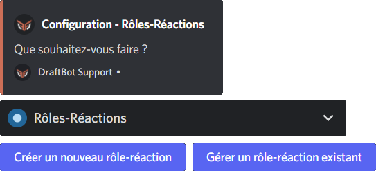
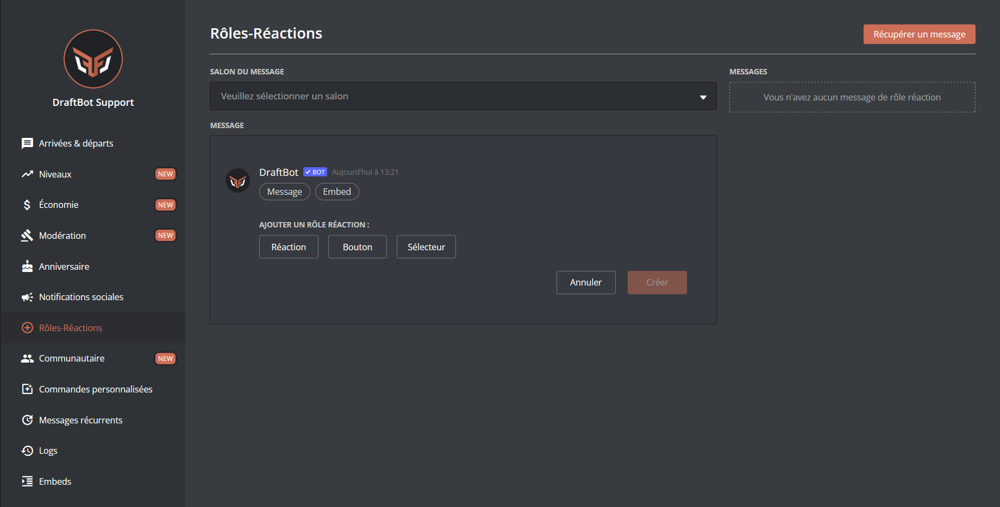
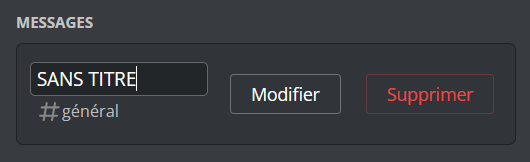
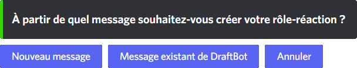
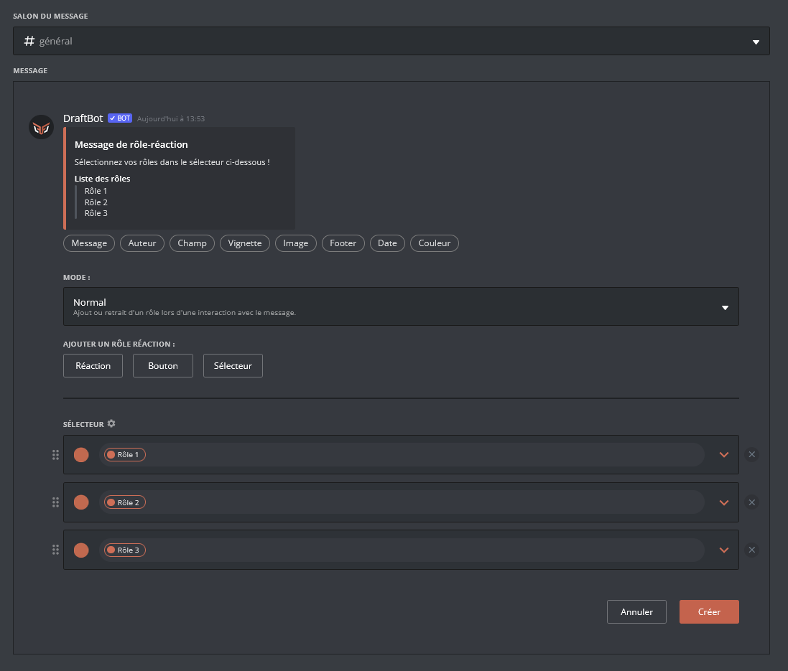
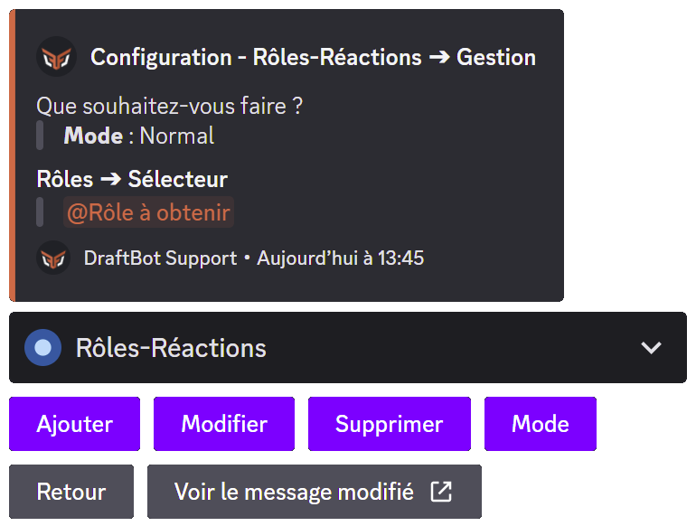
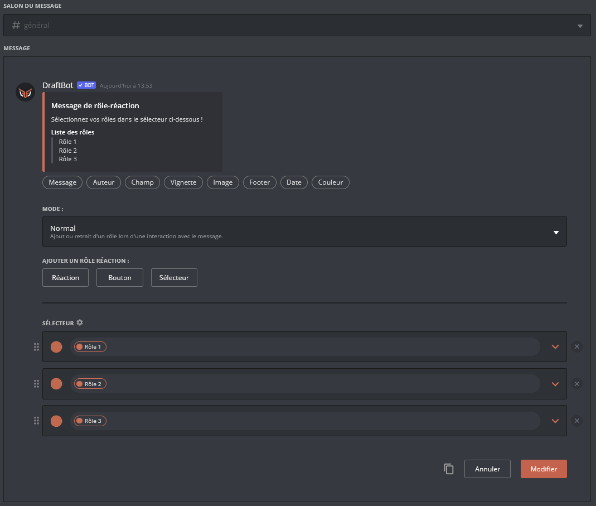

# 🔘 Rôles-réactions


Les rôles-réactions ne peuvent être ajoutés que sur des messages envoyés par **DraftBot**. Vous pouvez créer ces messages de différentes manières :
* *Depuis la commande <mark style="color:orange;">/envoyer</mark>* : Permet d'envoyer un message simple sous l'identité de **DraftBot**.
* *Depuis la configuration des rôles-réactions, via <mark style="color:orange;">/config</mark>* : Permet de créer un embed au titre personnalisé et au footer prédéfini.
* *Depuis l'Embed Creator du <mark style="color:blue;">[panel](https://www.draftbot.fr/dashboard)</mark>* : Permet la création complète et facile d'un message ou d'un embed entièrement personnalisable (description, champs, image...).


## Accéder à la configuration


<!-- Depuis Discord -->

Pour configurer le système de rôles-réactions, rendez-vous dans la catégorie "Rôles-Réactions" de la commande <mark style="color:orange;">/config</mark>. Deux choix s'offrent alors à vous :
* ***Créer un nouveau rôle-réaction*** ➜ Permet d'accéder au menu de [création d'un nouveau rôle-réaction](role-reactions.md#créer-un-nouveau-rôle-réaction).
* ***Gérer un rôle-réaction existant*** ➜ Permet de [gérer un rôle-réaction existant](role-reactions.md#gérer-un-rôle-réaction-existant) sur le message dont vous renseignez l'identifiant.



<!-- Depuis le panel web -->


<mark style="color:blue;">[Accéder au panel de **DraftBot**](https://draftbot.fr/dashboard)</mark>

Pour configurer le système de rôles-réactions, accédez au panel via le lien ci-dessus et rendez-vous dans la catégorie "Rôles-Réactions" sur le serveur de votre choix.




## Configuration


Vous pouvez donner des noms personnalisés aux rôles-réactions dans la partie à droite de la page. Pour cela, modifiez le texte de la zone de texte présente en haut à gauche de l'encadré d'un rôle-réaction.



### Créer un nouveau rôle-réaction


<!-- Depuis Discord -->

Pour créer un nouveau rôle-réaction, <mark style="color:orange;">[accédez à la configuration](#accéder-à-la-configuration)</mark> des rôles-réactions via la commande <mark style="color:orange;">/config</mark>.

Une fois fait, **DraftBot** vous demandera à partir de quel message vous souhaitez créer votre rôle-réaction :
* ***Nouveau message*** ➜ Créera un embed au titre personnalisé et au footer prédéfini.
* ***Message existant de DraftBot*** ➜ Récupérera un message de **DraftBot** ayant déjà été envoyé.

L'intégralité de la création est ensuite guidée par **DraftBot**, il vous suffit de suivre ses consignes.


<!-- Depuis le panel web -->

Pour créer un nouveau rôle-réaction, [accédez à la configuration](#accéder-à-la-configuration) des rôles-réactions via le panel.

<mark style="color:blue;">[Accéder au panel de **DraftBot**](https://draftbot.fr/dashboard)</mark>

* Si vous voulez créer un nouveau message, créez un message et/ou un embed grâce à l'Embed Creator se trouvant au centre de la page.
* Si vous voulez utiliser un message de **DraftBot** existant, cliquez sur le bouton "Récupérer un message" situé en haut à droite de la page et remplissez la fenêtre pop-up en indiquant le salon dans lequel se trouve le message, ainsi que l'[identifiant du message](../autres/recuperer-un-identifiant.md#identifiant-dun-message) à récupérer. Cliquez ensuite sur "Récupérer".

Ajoutez ensuite votre rôle-réaction, celui-ci pouvant être une "Réaction", un "Bouton" ou un "Sélecteur". Vous pouvez en ajouter plusieurs sur un même message.

Vous pouvez modifier le mode des rôles-réactions du message grâce au sélecteur situé en bas de l'Embed Creator.

Puis, dans le sélecteur situé en haut de l'Embed Creator, sélectionnez le salon dans lequel sera envoyé le message de rôle-réaction.


Enfin, cliquez sur "Créer" : votre rôle-réaction est créé !


> ⚠️ Une fois fini, n'oubliez pas d'enregistrer vos modifications avec le bouton "Enregistrer" en bas de la page.




### Gérer un rôle-réaction existant


<!-- Depuis Discord -->

Pour gérer un rôle-réaction existant, <mark style="color:orange;">[accédez à la configuration](#accéder-à-la-configuration)</mark> des rôles-réactions via la commande <mark style="color:orange;">/config</mark>.

Vous devrez ensuite indiquer le lien ou l'[<mark style="color:blue;">identifiant du message</mark>](../autres/recuperer-un-identifiant.md#identifiant-dun-message) sur lequel se trouve le rôle-réaction que vous souhaitez modifier.

Vous aurez ensuite accès au menu de gestion des rôles-réactions :
* ***Ajouter*** ➜ Ajouter un nouveau rôle-réaction.
* ***Modifier*** ➜ Modifier un rôle-réaction.
* ***Supprimer*** ➜ Supprimer un rôle-réaction.
* ***Mode*** ➜ Changer le mode des rôles-réactions présents sur le message.

L'intégralité de la création est ensuite guidée par **DraftBot**, il vous suffit de suivre ses consignes.


<!-- Depuis le panel web -->


<mark style="color:blue;">[Accéder au panel de **DraftBot**](https://draftbot.fr/dashboard)</mark>

Pour gérer un rôle-réaction existant, <mark style="color:orange;">[accédez à la configuration](#accéder-à-la-configuration)</mark> des rôles-réactions via le panel.

À droite de la page, vous retrouverez la liste de tous les rôles-réactions existants sur le serveur. Pour en modifier un, cliquer sur "Modifier".

Vous pourrez modifier les rôles-réactions de différentes façons :
* En modifiant le message du rôle-réaction via l'Embed Creator se trouvant au centre de la page.
* En modifiant le mode du rôle-réaction à l'aide du sélecteur se trouvant juste en dessous de l'Embed Creator.
* En ajoutant, modifiant ou supprimant un rôle-réaction dans la section se trouvant en dessous du sélecteur de mode.


Enfin, cliquez sur "Modifier" : votre rôle-réaction est modifié !


> ⚠️ Une fois fini, n'oubliez pas d'enregistrer vos modifications avec le bouton "Enregistrer" en bas de la page.


