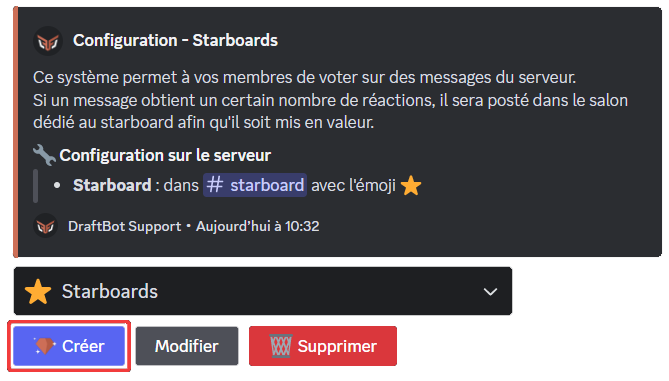
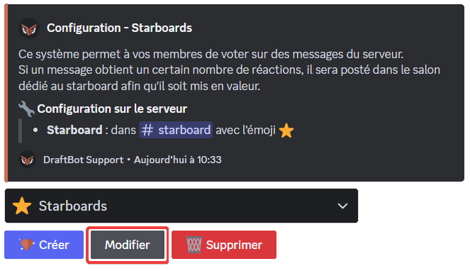
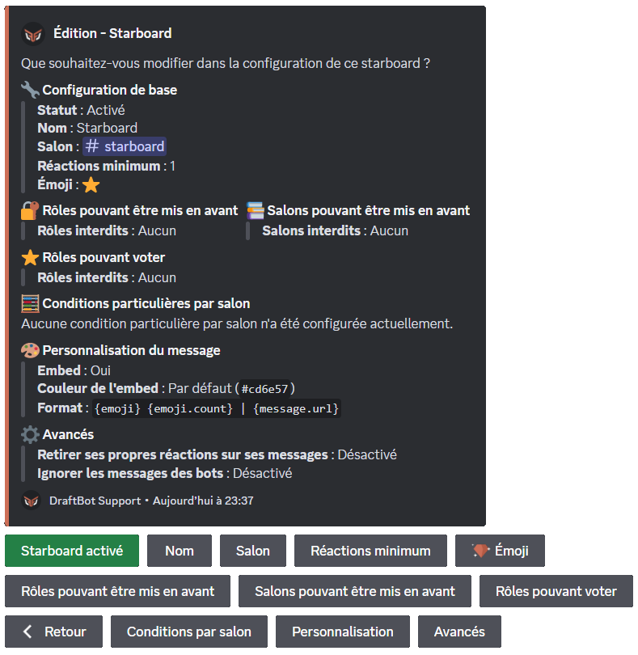
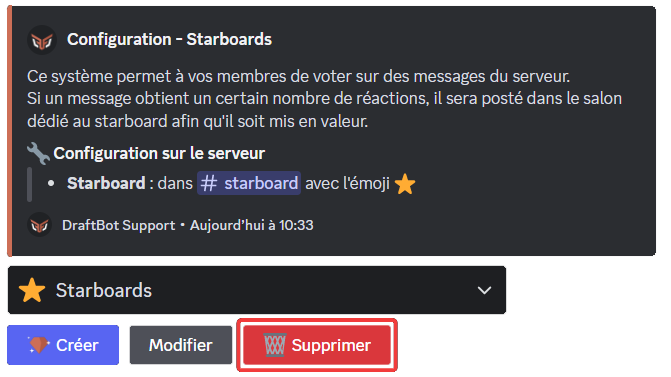
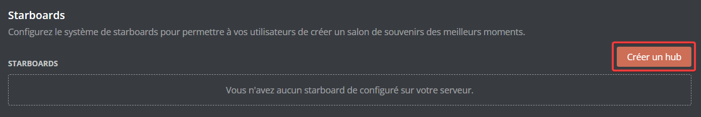
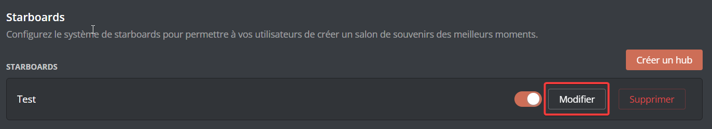
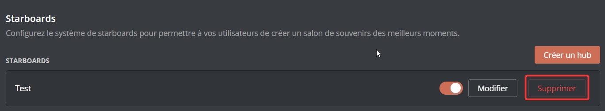
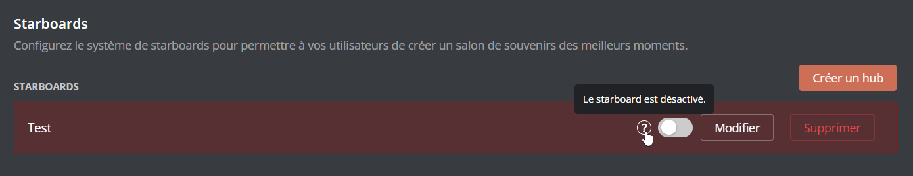

# ⭐ Starboards

## Comment ça marche ? 

Le système de starboard foncionne à base de réaction sous un message. Principalement, cela permet de faire des votes entre certains messages. Mais cela peut servir aussi à d'autres choses. Lorsqu'un message atteint un certain nombre de réaction, il est retranscrit par DraftBot, sous forme embed ou pas, dans un salon, créé au préalable ou choisit lors de la configuration.

## Configuration du système 




### Créer un starboard

Pour créer un starboard par commande, il suffit de faire la commande <mark style="color:orange;">/config</mark> en sélectionnant Starboards. Ensuite, cliquez sur Créer. De là, DrafBot vous posera plusieurs afin de configurer au mieux votre premier starboard. 



- Pour pouvoir créer jusqu'à 5 starboards et choisir l'émoji en question pour les réactions, il faut être ✨ <mark style="color:orange;">[premium](https://www.draftbot.fr/premium/)</mark>.



### Modifier un starboard

Pour modifier un starboard, il faut d'abord faire la commande /config en sélectionnant Starboards. Puis, cliquez sur Modifier. Par la suite, DraftBot vous affichera une sorte de panel de configuration. Exemple ci dessous. Vous pouvez choisir si la représentation du message dans le salon soit dans un embed ou pas mais vous pouvez également chosir dans quel salon vous souhaitez qu'il s'y trouve.



Vous pouvez définir entre 1 et 25 réactions minimum avant qu'un message apparaisse dans le salon dédié à ce starboard.



Liste des variables disponibles pour ce système

Les variables sont des bouts de texte qui évoluent suivant la personne, le serveur, le salon ou encore le temps.Voici celles utilisables pour le système de starboard : 
 
- `{user}` = Surnom du membre sur le serveur.
- `{user.username}` = Pseudo du compte du membre.
- `{user.globalname}` = Nom affiché du compte du membre.
- `{emoji}` = Emoji du starboard.
- `{emoji.count}` = Nombre de réactions.
- `{message.url}` = Lien du message.



La forme basique que DraftBot donne lors de la configuration est `{emoji} {emoji.count} | {message.url}`.



### <mark style="color:red;">Supprimer un starboard</mark>

Pour supprimer un starboard, il suffit de faire la commande /config toujours en sélectionnant Starboards. Enfin, il vous faudra cliquer sur Supprimer en rouge.




Pour configurer le système via le [panel](https://www.draftbot.fr/dashboard/), il vous suffit de vous diriger dans l'onglet <mark style ="color:blue;">Communautaire</mark>. Ensuite, descendez un la liste des système et vous trouverez le système de starboards.

### Créer un starboard

Pour créer un starboard via le <mark style="color:orange;">[panel](https://www.draftbot.fr/dashboard)</mark>, il faut vous rendre dans la catégorie Communautaire. Ensuite, déscendez dans la partie Starbaords et cliquez sur Créer un hub. Par la suite, DraftBot vous proposera une sorte de menu de configuration pour configurer votre premier starboard.



Pour pouvoir créer jusqu'à 5 starboards et choisir l'émoji en question pour les réactions, il faut être ✨ <mark style="color:orange;">[premium](https://www.draftbot.fr/premium/)</mark>.



### Modifier un starboard

Pour modifier un starboard, il vous suffit de cliquer sur Modifier qui se trouve toujours dans le <mark style="color:orange;">[panel](https://www.draftbot.fr/dashboard)</mark>, dans la catégorie Communautaire, dans la partie Staboards.  Vous pouvez choisir si la représentation du message dans le salon soit dans un embed ou pas mais vous pouvez également chosir dans quel salon vous souhaitez qu'il s'y trouve.


Vous pouvez définir entre 1 et 25 réactions minimum avant qu'un message apparaisse dans le salon dédié à ce starboard.



### <mark style="color:red;">Supprimer un starboard</mark>

Pour supprimer un starboard, cliquez sur le bouton supprimer qui se trouve également dans le <mark style="color:orange;">[panel](https://www.draftbot.fr/dashboard)</mark>, dans la catégorie Communautaire, dans la partie Staboards.


Si vous le souhaitez, vous pouvez désactiver votre starboard tout en le conservant, il vous suffit juste de cliquer sur l'encoche à gauche du bouton Modifier.



Liste des variables disponibles pour ce système

Les variables sont des bouts de texte qui évoluent suivant la personne, le serveur, le salon ou encore le temps.Voici celles utilisables pour le système de starboard : 
 
- `{user}` = Surnom du membre sur le serveur.
- `{user.username}` = Pseudo du compte du membre.
- `{user.globalname}` = Nom affiché du compte du membre.
- `{emoji}` = Emoji du starboard.
- `{emoji.count}` = Nombre de réactions.
- `{message.url}` = Lien du message.


La forme basique que DraftBot donne lors de la configuration est "{emoji} {emoji.count} | {message.url}".




