# 💡 Suggestions

## Utilisation

### Menu des suggestions

Pour accéder au menu des suggestions, vous devez vous rendre dans <mark style="color:orange;">/suggest</mark>.

Cette commande vous permet de soumettre de nouvelles suggestions, ajouter des commentaires, accéder à celles-ci (en cliquant sur leurs titres) ou encore, voir leur état. C'est-à-dire que vous pourrez voir le pourcentage de votes de vos suggestions, mais aussi si elles ont été acceptées, refusées ou si elles sont prévues.

Vous pourrez également décider de vous faire notifier ou non en cas d'un changement de <mark style="color:blue;">[statut](suggestions.md#gerer-une-suggestion)</mark> sur l'une de vos suggestions.


Il faut que l'option "Notification lors du changement de statut" soit <mark style="color:blue;">[activée](suggestions.md#tri-des-suggestions)</mark> sur le serveur. Si ce n'est pas le cas, vous ne verrez pas le bouton "Me notifer en cas de changement de statut"


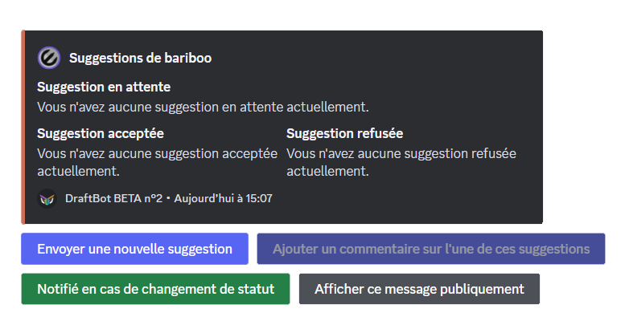

### Soumettre une suggestion

Pour soumettre une suggestion, il faut vous rendre dans le [menu des suggestions](suggestions.md#menu-des-suggestions) (<mark style="color:orange;">/suggest</mark>) puis cliquer sur le bouton "<mark style="color:blue;">Envoyer une nouvelle suggestion</mark>".

**DraftBot** vous ouvrira ensuite un pop-up où vous pourrez renseigner :
* Titre ➜ Le titre à donner à votre suggestion. Il permettra aussi de la référencer dans le [menu des suggestions](suggestions.md#menu-des-suggestions).
* Description ➜ La description de votre suggestion, où vous pourrez détailler votre suggestion pour mieux l'expliquer aux autres membres.


Pour ajouter une image d'illustration à votre suggestion, vous devez avoir activé <mark style="color:blue;">[la demande de confirmation](suggestions.md#confirmation)</mark> lors de la configuration.
Vous aurez alors un bouton pour ajouter une image lors de cette confirmation.


### Commenter une suggestion

**DraftBot** vous laisse la possibilité de commenter vos suggestions, c'est-à-dire que vous pourrez, si vous avez oublier une information lors de la publication de cette dernière, ajouter un commentaire en cliquant sur "<mark style="color:blue;">Ajouter un commentaire sur l'une de ces suggestions</mark>" dans le [menu des suggestions](suggestions.md#menu-des-suggestions).


Il faut que l'option "<mark style="color:blue;">[commentaire après publication](suggestions.md#membres)</mark>" soit activée. 


### Gérer une suggestion

**DraftBot** vous propose de pouvoir accepter, refuser ou prévoir une suggestion.\
Découvrez dans le menu ci-dessous comment faire :


Vous avez besoin de la permission "Gérer les messages" pour pouvoir accepter, refuser ou prévoir une suggestion. Toutefois, vous pouvez toujours modifier cette permission depuis les paramètres de votre serveur ➜ "Intégrations" puis sélectionner **DraftBot** et taper "/suggestmod" dans la barre de recherche située en haut de votre écran. (Uniquement disponible sur ordinateur) 




Pour accepter une suggestion, vous pouvez utiliser la commande <mark style="color:orange;">/suggestmod accepter</mark>. Vous devrez ensuite saisir l'<mark style="color:blue;">[identifiant](https://docs.draftbot.fr/autres/recuperer-un-identifiant#message)</mark> du message de la suggestion à acceptée. Finalement, vous aurez la possibilité de donner une raison d'acceptation.


Vous avez aussi la possibilité de faire un clic droit (sur ordinateur) ou d'appuyer longtemps (sur mobile) sur la suggestion en question puis d'aller dans "Applications". Vous aurez ensuite la possibilité d'accepter la suggestion.

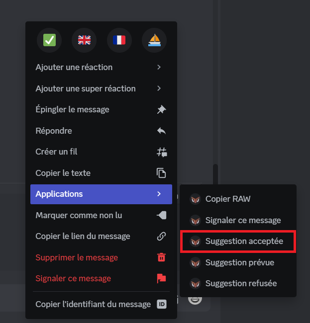





Pour refuser une suggestion, vous pouvez utiliser la commande <mark style="color:orange;">/suggestmod refuser</mark>. Vous devrez ensuite saisir l'<mark style="color:blue;">[identifiant](https://docs.draftbot.fr/autres/recuperer-un-identifiant#message)</mark> du message de la suggestion à refusée. Finalement, vous aurez la possibilité de donner une raison de refus.


Vous avez aussi la possibilité de faire un clic droit (sur ordinateur) ou d'appuyer longtemps (sur mobile) sur la suggestion en question puis d'aller dans "Applications". Vous aurez ensuite la possibilité de refuser la suggestion.

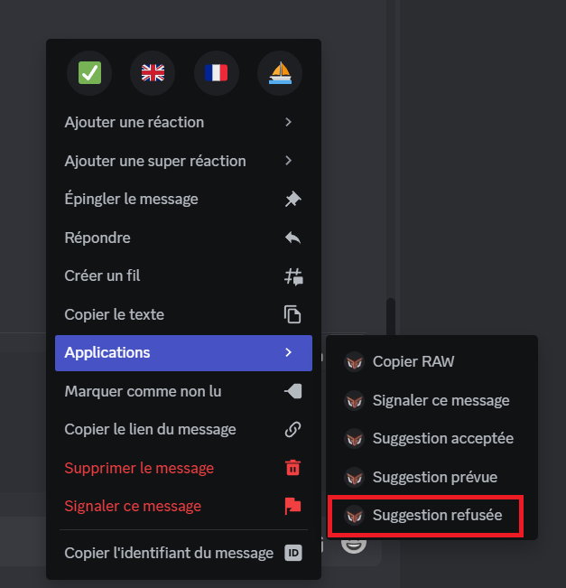





Pour prévoir une suggestion, vous pouvez utiliser la commande <mark style="color:orange;">/suggestmod prevue</mark>. Vous devrez ensuite saisir l'<mark style="color:blue;">[identifiant](https://docs.draftbot.fr/autres/recuperer-un-identifiant#message)</mark> du message de la suggestion à marquée comme prévue. Finalement, vous aurez la possibilité de donner une raison de prévision.


Vous avez aussi la possibilité de faire un clic droit (sur ordinateur) ou d'appuyer longtemps (sur mobile) sur la suggestion en question puis d'aller dans "Applications". Vous aurez ensuite la possibilité de "prévoir" la suggestion.

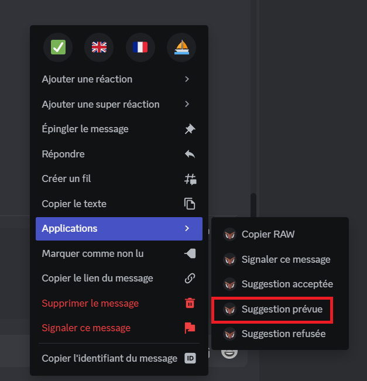




Vous vous rendez compte que vous avez fait une erreur ? Vous pouvez toujours repasser une suggestion en attente via la commande <mark style="color:orange;">/suggestmod attente</mark>. Il est également possible de repasser par le menu "Applications" puis sélectionner la nouvelle manière dont vous souhaitez classer votre suggestion. Vous aurez ensuite à saisir l'<mark style="color:blue;">[identifiant](https://docs.draftbot.fr/autres/recuperer-un-identifiant#message)</mark> du message de la suggestion.


Vous avez aussi la possibilité de repasser une suggestion en attente ou en changer la raison en passant depuis le menu "Applications" puis sélectionner la même option de classement (accepter si la suggestion est acceptée).


## Configuration




### Configuration de base

* "<mark style="color:blue;">Activer le système</mark>" ➜ Permet d'activer ou désactiver le système.
* "<mark style="color:blue;">Salon de réception</mark>" ➜ Sert à définir le salon où seront envoyées les suggestions.
* "Mention" ➜ Paramétrer un rôle qui sera mentionné lors de l'envoi d'une nouvelle suggestion.
* "Couleur en fonction des votes" ➜ Une fois cette option activée, **DraftBot** changera la couleur de l'embed en fonction du pourcentage de vote pour ou contre.


Si vous êtes souscrit à un abonnement <mark style="color:pink;">[premium](https://draftbot.fr/premium)</mark>, vous pourrez chosir les couleurs du dégradé, en cliquant sur "✨ Dégradé personnalisé".


### Réactions 

En cliquant sur le bouton "Réactions", vous aurez accès à ce menu :

* "Activer le retrait des réactions après traitement" ➜ Une fois la suggestion <mark style="color:blue;">[traitée](suggestions.md#gerer-une-suggestion)</mark>, **DraftBot** retirera les réactions sous la suggestion.
* "Vote favorable" ➜ Définir l'émoji sous la suggestion pour donner un avis positif.
* "Vote neutre" ➜ Paramétrer l'émoji sous la suggestion pour de donner un avis neutre.


Vous pouvez également ne pas définir de vote neutre en cliquant sur "Vote neutre" puis <mark style="color:red;">"Non"</mark>.


* "Vote défavorable" ➜ Permet de définir l'émoji sous la suggestion pour de donner un avis négatif.

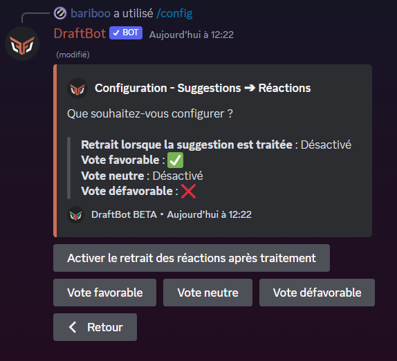

### Confirmation

En cliquant sur le bouton "Confirmation", vous aurez accès à ce menu :

* "Activer la confirmation avant envoi" ➜ Cette option sert à ce que le membre puisse modifier sa suggestion s'il se rend compte qu'il a fait une erreur ou à ajouter une image avant de l'envoyer.


Si cette option n'est pas activée, il vous sera impossible d'ajouter une image à vos suggestions.


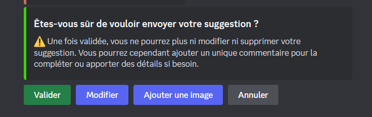

* "Message de confirmation après envoi" ➜ Vous pouvez définir un message personnalisé qui sera envoyé lorsqu'un membre enverra une nouvelle suggestion.


Cette option n'est pas désactivable, si vous décidez de ne pas la personnaliser, voici le message qui sera envoyé :
> Merci de votre suggestion. Elle a été ajoutée aux suggestions du serveur !


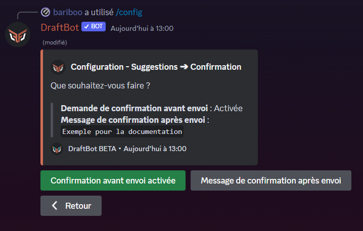

### Tri des suggestions

En cliquant sur le bouton "Tri des suggestions", vous aurez accès à ce menu :

* "Activer le tri des suggestions" ➜ Sert à activer / désactiver le tri des suggestions.
* "Masquer le nom du modérateur" ➜ Cette option sert à masquer le nom de la personne qui aura [géré la suggestion](suggestions.md#gerer-une-suggestion).
* "Activer les notifications" ➜ Une fois cette option activée le membre qui aura fait la suggestion pourra, ou non être notifié lorsque sa suggestion changera de [statut](suggestions.md#gerer-une-suggestion).

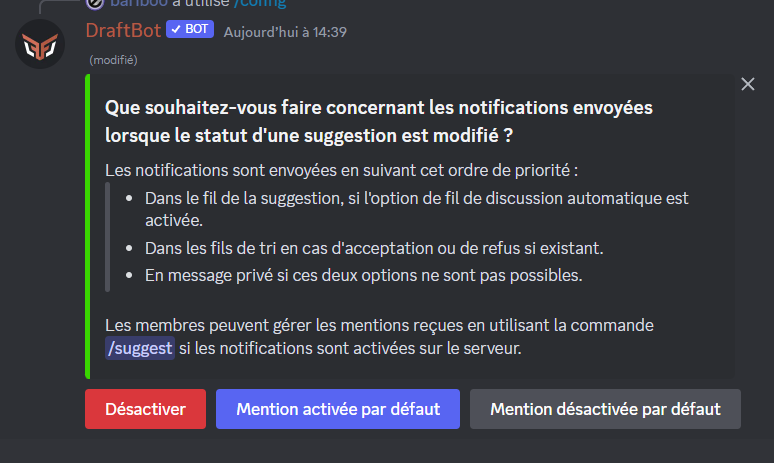

* "<mark style="color:red;">Désactiver</mark>" ➜ Désactiver le système de notifications lors du changement de statut.
* "<mark style="color:blue;">Mention activée par défaut</mark>" ➜ Une fois cette option activée, les membres seront toujours notifié lors du changement de statut.
* "Mention désactivée par défaut" ➜ Une fois cette option activée, les membres ne seront pas notifiés lors du changement de statut.


Pour les deux dernières options citées ci-dessus, il sera possible pour vos membres de modifier le paramètre par défaut en passant par "<mark style="color:orange;">/suggest</mark>" puis "Me notifier en cas de changement de statut".


* "<mark style="color:blue;">Définir le fil des suggestions acceptées</mark>" ➜ Une fois le fil défini, toutes les suggestions acceptées se rendront automatiquement dans ce fil.
* "<mark style="color:blue;">Définir le fil des suggestions refusée</mark>" ➜ Une fois le fil défini, toutes les suggestions refusées se rendront automatiquement dans ce fil.

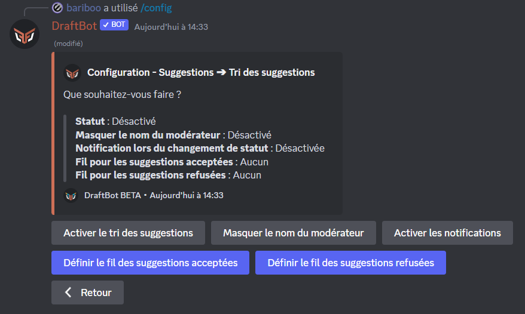

### Membres

En cliquant sur le bouton "Membres", vous aurez accès à ce menu :

* "Limiter les suggestions en attente" ➜ Grâce à ce bouton, vous pouvez décider de limiter le nombre de suggestion que vos membres pourront envoyer. 


Le nombre de suggestions en simultané peut être compris de **1** à **10**.

Une fois la suggestion [traitée](suggestions.md#gerer-une-suggestion), elle ne sera plus comptabilisé dans le nombre de suggestions simultanées par membre. 

* "Activer le commentaire après publication" ➜ Une fois cette option activée, si un de vos membres oublie un détail important sur sa suggestion, il pourra après coup ajouter un commentaire sous sa suggestion en passant par <mark style="color:orange;">/suggest</mark>.

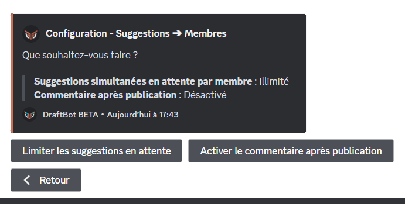

### ✨ Fils de discussions automatiques

En cliquant sur le bouton "✨ Fils de discussions automatiques", vous aurez accès à ce menu :

* "Activer l'ouverture d'un fil" ➜ Une fois cette option activée, **DraftBot** ouvrira un fil sous chaque suggestion soumise.
* "Modifier le nom du fil" ➜ Vous pourrez modifier le nom du fil qui s'ouvrira sous chaque suggestion.


Vous pouvez mettre différentes variables dans le nom du fil :

Variables

Les variables sont des bouts de texte qui évoluent suivant la personne, le serveur, le salon ou encore le temps. Voici celles utilisables dans le nom des fils automatiquement ouverts par DraftBot.

- `{user}` ➜ Mention du membre
- `{user.id}` ➜ Identifiant du membre
- `{user.username}` ➜ Pseudo du membre
- `{user.nickname}` ➜ Surnom ou pseudo du membre
- `{user.tag}` ➜ Tag du membre _(Pseudo#0000)_
- `{server}` ➜ Nom du serveur
- `{server.id}` ➜ Identifiant du serveur
- `{server.name}` ➜ Nom du serveur
- `{server.membercount}` ➜ Nombre de membres sur le serveur
- `{date}` ➜ Date actuelle (JJ/MM/AAAA)
- `{time}` ➜ Heure actuelle (HH:MM)
- `{timestamp}` ➜ Timestamp actuel en secondes



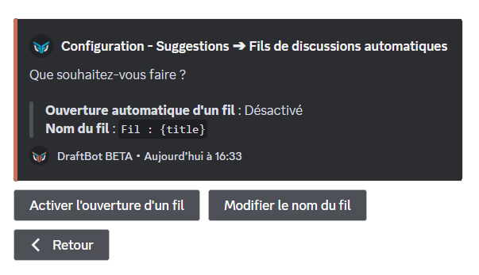




Veuillez d'abord vous rendre sur le <mark style="color:blue;">[panel de **DraftBot**](https://draftbot.fr/dashboard/)</mark> ➜ Suggestions.

Si vous n'avez pas encore configuré le système, vous tomberez sur cette page :  

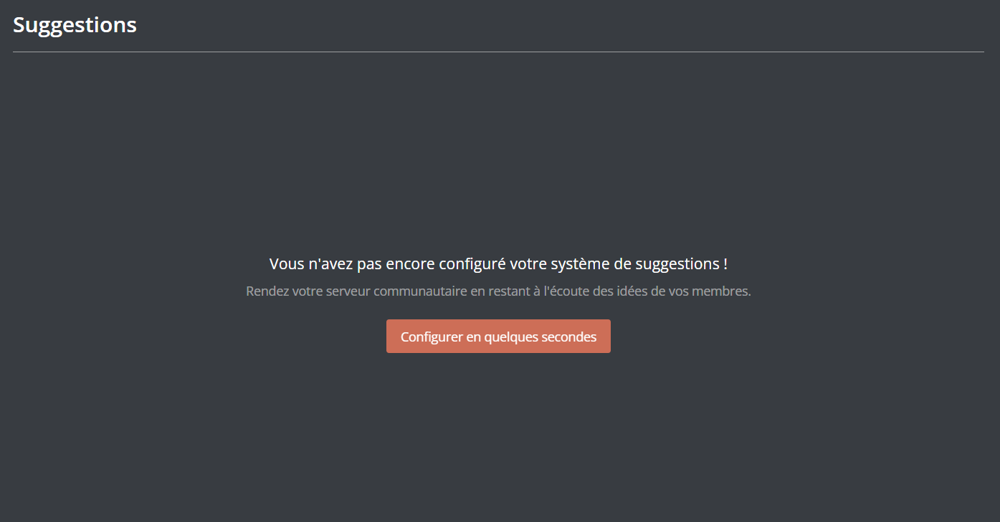

En cliquant sur "Configurer en quelques secondes", vous tomberez sur ce pop-up : 

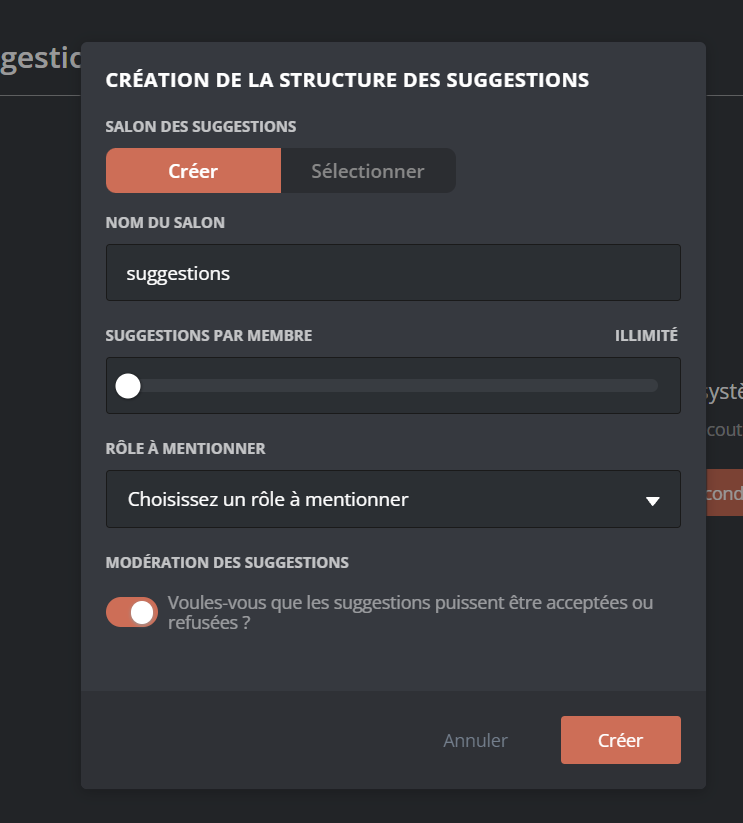

Vous pourrez y configurer la structure de votre système :

* "Salon des suggestions" ➜ Paramétrer le salon dans lequel seront envoyées les suggestions.


La différence entre l'onglet "Créer" et "Sélectionner" est que dans le premier onglet, vous choisirez le nom du salon que **DraftBot** créera et dans le deuxième, vous choisirez un salon déjà créé.  


* "Suggestions par membre" ➜ Vous pourrez y limiter le nombre de suggestion <mark style="color:blue;">[non-traitée](suggestions.md#gerer-une-suggestion)</mark> par membre.
* "Rôle à mentionner" ➜ Paraméter le rôle qui sera mentionné lors de l'envoi d'une nouvelle suggestion.
* "Modération des suggestions" ➜ Une fois cette option activée, les suggestions pourront être [refusées, acceptées ou prévues](suggestions.md#gerer-une-suggestion).

Une fois cela fait, d'autres options de configuration s'offriront à vous :

* "Message de confirmation d'une suggestion" ➜ Configurer le message qui s'enverra automatiquement lorsqu'un membre enverra une nouvelle suggestion.


Cette option n'est pas désactivable, si vous décidez de ne pas la personnaliser, voici le message qui sera envoyé :

> Merci de votre suggestion. Elle a été ajoutée aux suggestions du serveur !


* "Réactions" ➜ Paramétrer les différentes réactions pour donner un avis positif, neutre ou négatif.


Le vote "neutre" peut être retiré des réactions.


* "Demande de confirmation" ➜ Une fois la suggestion envoyée, **DraftBot** proposera une dernière fois au membre de pouvoir modifier sa suggestion ou encore y ajouter une image.


Si cette option n'est pas activée, il vous sera impossible d'ajouter une image à vos suggestions.


* "Variation de la couleur" ➜ Suivant le pourcentage de votes pour ou contre, la couleur variera.


Pour les utilisateurs <mark style="color:pink;">[premium](https://draftbot.fr/premium)</mark>, vous pourrez décider des couleurs.


* "Ouverture automatique d'un fil de discussion" (✨) ➜ Paramétrer l'ouverture automatique d'un fil lorsqu'une nouvelle suggestion est envoyée.


Vous pouvez mettre différentes variables dans le nom du fil :

Variables

Les variables sont des bouts de texte qui évoluent suivant la personne, le serveur, le salon ou encore le temps. Voici celles utilisables dans le nom des fils automatiquement ouverts par DraftBot.

- `{user}` ➜ Mention du membre
- `{user.id}` ➜ Identifiant du membre
- `{user.username}` ➜ Pseudo du membre
- `{user.nickname}` ➜ Surnom ou pseudo du membre
- `{user.tag}` ➜ Tag du membre _(Pseudo#0000)_
- `{server}` ➜ Nom du serveur
- `{server.id}` ➜ Identifiant du serveur
- `{server.name}` ➜ Nom du serveur
- `{server.membercount}` ➜ Nombre de membres sur le serveur
- `{date}` ➜ Date actuelle (JJ/MM/AAAA)
- `{time}` ➜ Heure actuelle (HH:MM)
- `{timestamp}` ➜ Timestamp actuel en secondes



* "Supression des réactions" ➜ Lorsqu'une suggestion sera <mark style="color:blue;">[traitée](suggestions.md#gerer-une-suggestion)</mark>, les réactions seront retirées de la suggestion.
* "Commentaire de la part de l'auteur" ➜ Une fois activé, vos membres pourront ajouter un commentaire sur leur suggestion s'ils ont oublié un détail.
* "Masquer le pseudo du modérateur" ➜ Le nom de la personne ayant <mark style="color:blue;">[traitée](suggestions.md#gerer-une-suggestion)</mark> la suggestion ne sera pas affiché sur la suggestion.
* "Fils de tri" ➜ Une fois les suggestions <mark style="color:blue;">[traitées](suggestions.md#gerer-une-suggestion)</mark>, elles seront automatiquement dans les fils configurés ici.
* "Notification de changements" ➜ Lorsque la suggestion change de statut, c'est-à-dire si elle est acceptée, refusée, ou prévue. L'auteur de la suggestion sera mentionné soit dans le fil de la suggestion (si l'option est activée), dans les fils de tri ou dans les messages privés.


Les membres pourront toujours modifier les paramètres par défaut depuis la commande <mark style="color:orange;">/suggest</mark>.


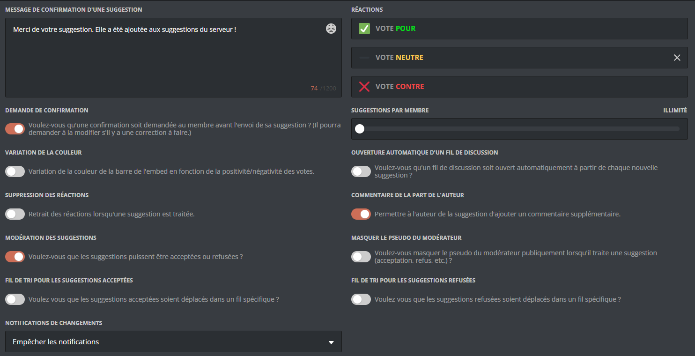

> ⚠️ Une fois fini, n'oubliez pas d'enregistrer vos modifications avec le bouton "Enregistrer" en bas de la page.


