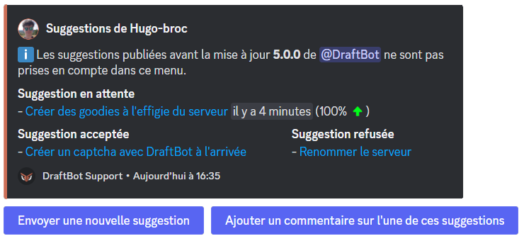
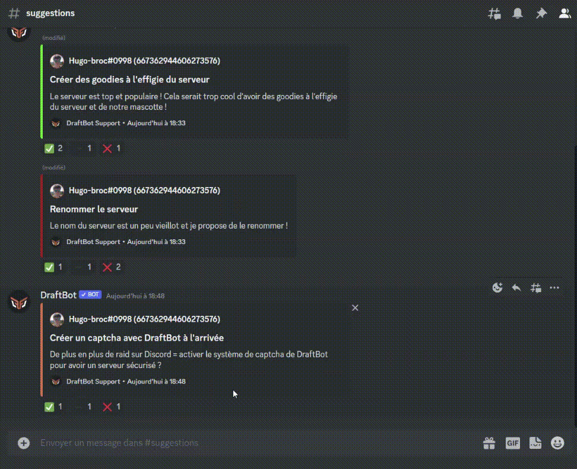
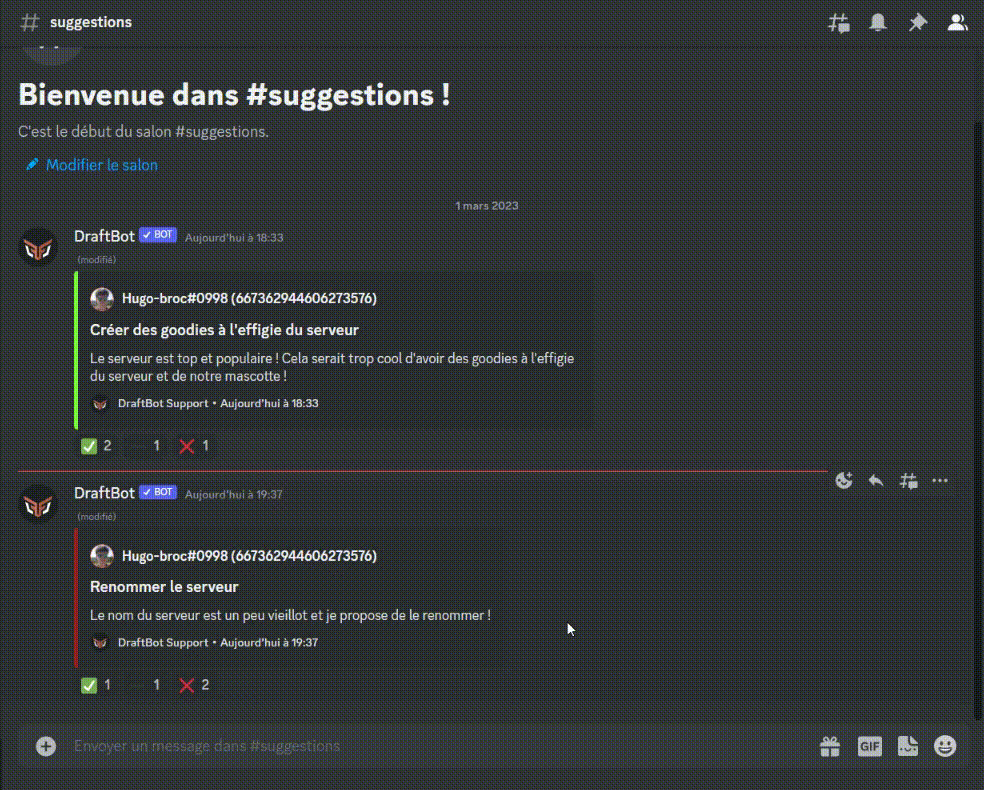

# 💡 Suggestions

## Utilisation
### Menu des suggestions

Pour accéder au menu des suggestions, faites la commande <mark style="color:orange;">/suggest</mark>.
> Pour proposer une suggestion avec **DraftBot**, vous passerez forcément par ce menu.

Le menu des suggestions vous permet de voir l'état de vos suggestions.\
Vous pourrez ainsi voir le pourcentage de vote de vos suggestions mais aussi si elles ont été acceptées ou refusées.

Un lien sur le titre de votre suggestion vous permettra de la retrouver facilement.


Ce système n'étant disponible que depuis peu, il n'est pas possible de répertorier les suggestions qui datent d'avant le 12 décembre 2022.


### Proposer une suggestion

Pour proposer une suggestion, il vous faut faire la commande <mark style="color:orange;">/suggest</mark>.

Vous accéderez ensuite au <mark style="color:orange;">[menu des suggestions](suggestions.md#menu-des-suggestions)</mark>. Pour créer une nouvelle suggestion, appuyez sur le bouton "<mark style="color:blue;">Envoyer une nouvelle suggestion</mark>".

**DraftBot** vous ouvrira ensuite une page où vous pourrez renseigner :
* Titre ➜ Le titre à donner à votre suggestion. Il permettra aussi de la référencer dans le menu des suggestions.
* Description ➜ La description de votre suggestion, où vous pourrez détailler votre suggestion pour mieux l'expliquer aux autres membres.


Pour ajouter une image d'illustration à votre suggestion, vous devez avoir activé la demande de confirmation lors de la configuration.
Vous aurez alors un bouton pour ajouter une image lors de cette confirmation.


**Vous avez oublié une information lors de la création de votre suggestion ou vous voulez ajouter un commentaire à cette dernière ?**\
Vous pouvez alors sélectionner le bouton "<mark style="color:blue;">Ajouter un commentaire sur l'une de ces suggestions</mark>" pour en ajouter un.

### Gérer une suggestion

**DraftBot** vous propose de pouvoir accepter ou refuser une suggestion.\
Découvrez dans le menu ci-dessous comment faire !


Vous avez besoin de la permission "*Gérer les messages*" pour pouvoir accepter ou refuser une suggestion.




Pour accepter une suggestion, faites un clic droit (sur pc) ou appuyez longtemps (sur portable) sur la suggestion en question et appuyez sur "Applications".\
Vous aurez ensuite la possibilité d'"Accepter" la suggestion.

Un menu s'ouvrira et vous demandera votre raison d'acceptation.\
Si vous ne souhaitez pas mettre de raison d'acceptation, appuyez directement sur "<mark style="color:blue;">Envoyer</mark>" sans rentrer de texte dans la case.




Pour refuser une suggestion, faites un clic droit (sur pc) ou appuyez longtemps (sur portable) sur la suggestion en question et appuyez sur "Applications".\
Vous aurez ensuite la possibilité de "Refuser" la suggestion.

Un menu s'ouvrira et vous demandera votre raison de refus.\
Si vous ne souhaitez pas mettre de raison de refus, appuyez directement sur "<mark style="color:blue;">Envoyer</mark>" sans rentrer de texte dans la case.




## Configuration

