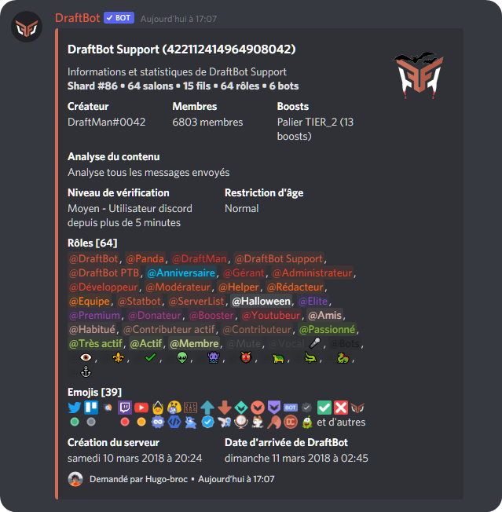
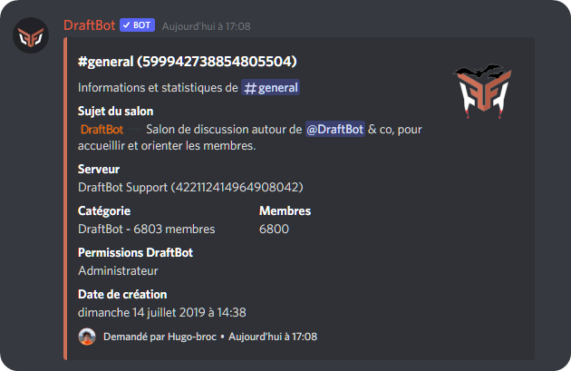

# Commandes d'informations

## UserInfo

La commande `userinfo` indique les informations détaillées d'un utilisateur comme son identifiant, sa date d'arrivée sur le serveur, la date de création de son compte et bien plus encore.


Si aucun membre est indiqué après la commande, vos informations seront affichées.


## BotInfo

La commande `botinfo` vous permet d'obtenir des informations sur **DraftBot** comme son nombre de serveurs, d'utilisateurs, sa version, des liens utiles, etc.

## ServerInfo

La commande `serverinfo` permet d'obtenir des informations détaillées du serveur Discord.&#x20;

## ChannelInfo

La commande `channelinfo` permet d'obtenir des informations sur un salon comme sa catégorie, sa date de création, les permissions de **DraftBot** dans le salon et bien plus.

## RoleInfo

La commande `roleinfo` permet d'obtenir des informations sur un rôle comme sa date de création, ses membres, son identifiant et plus encore.

## Profil

La commande `profil` permet d'obtenir des informations sur un utilisateur comme sa description, sa date d'arrivée sur le serveur, son niveau et son argent si les systèmes de niveaux et d'économie sont activés.

