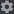

# Notifications sociales

## Configuration depuis le panel

DraftBot dispose d'un [panneau de configuration web (panel)](https://draftbot.fr/dashboard) disponible via le site permettant de configurer facilement ses différents systèmes supportés, dont les notifications sociales !

Afin d'accéder aux notifications sociales via le panel, il suffit de sélectionner votre serveur à configurer et de vous rendre dans la catégorie "Notifications sociales"

Une fois sur la page de configuration des notifications sociales, vous avez divers réseaux sociaux à configurer :

* **YouTube** (annonces vidéos YouTube)
* **Twitch** (annonces lives Twitch) - [_premium_](https://draftbot.fr/premium) _seulement_
* **Lives présences Discord** (annonce de live Twitch des membres avec l'un des rôles autorisés ayant le statut "En stream" sur Discord)
* **Feeds Reddit** (annonces des postes sur un Subreddit)
* **Epic Games** (annonces de sortie des nouveaux jeux gratuits)
* **Dealabs** (annonces de bons plans)
* **CommitStrip** (annonces des sorties de bandes dessinées)

### YouTube 

Vous pouvez ajouter une chaîne YouTube en actionnant le bouton à droite de la catégorie et en appuyant sur "Ajouter une chaîne". Dans la configuration :

* Il faut indiquer le lien vers la chaîne YouTube accessible depuis la page d'accueil de la chaîne sur youtube.com.
* Ensuite, sélectionnez le salon où sera envoyé le message annonçant les nouvelles vidéos.
* Il est possible de modifier le message avec les variables, ainsi que d'ajouter un embed dans lequel la vidéo sera affichée avec une couleur personnalisée.
* Pour finir, il vous faut sauvegarder vos modifications. Vous pourrez modifier la configuration de la chaîne en appuyant sur "Modifier".

  (1).png>)


Sans [premium](https://www.draftbot.fr/premium), il n'est possible d'avoir qu'une chaîne YouTube, avec, la limite de chaîne passe à 3.


### Twitch 


Les annonces de lives Twitch sont réservées aux serveurs [premium](https://draftbot.fr/premium) pour une limite de 3 chaînes



L'annonce de [lives présence discord](notifications-sociales.md#lives-presence-discord) peut être un alternatif pour les streamer sur le serveur


Il est possible d'annoncer les streams d'une chaîne Twitch en activant le système et en ajoutant la chaîne sur le panel. Dans la configuration :

* Il faut indiquer le lien ou le nom de la chaîne Twitch parfaitement ainsi que le salon où sera envoyée l'annonce.
* Vous pouvez modifier le message avec des variables.
* Puis il est possible d'ajouter un embed dans lequel sera affichée l'image du stream et d'y modifier la couleur.
* Ensuite pour modifier la configuration de la chaîne Twitch, vous pourrez appuyer sur le bouton "Modifier".

### Lives présence Discord

Annoncez vos propres streams Twitch avec le live présence Discord s'activant lorsque vous êtes en live avec votre compte Twitch relié à votre Discord ! Cela peut être un alternatif aux annonces Twitch classiques. Pour configurer le système :

* Indiquez le salon où sera envoyée l'annonce de live.
* Sélectionnez les rôles autorisés à avoir leurs lives annoncés.
* Vous pouvez modifier le message d'annonce avec des variables et y ajouter un embed accompagné d'une couleur personnalisée.
* Si le salon sélectionné est un salon d'annonce du système de communauté Discord, sur lequel vos membres peuvent avoir les annonces envoyées également sur leur serveur, vous pouvez autoriser ou non l'envoi des annonces de lives sur les serveurs de vos membres. 
* Puis il est possible supprimer automatiquement l'annonce lorsque le live est terminé (Si le membre n'a plus son live presence).

### Feeds Reddit 

Affichez les postes de Subreddit spécifiques sur votre serveur Discord afin d'en faire profiter vos membres ! Pour configurer le système :

* Donnez le nom du Subreddit et sélectionnez le salon dans lequel les postes seront envoyés.
* Ajoutez ou non des mots au filtre pour n'envoyer que les postes incluant dans le titre ou la description les mots clés configurés.
* Indiquez ou non le nombre d'upvote minimum sur les postes pour qu'ils soient envoyés sur votre serveur.
* Modifiez ou non le message avec les variables et autorisez, si vous le souhaitez, l'ajout d'un embed avec une couleur personnalisée.


Sans [premium](https://www.draftbot.fr/premium), il n'est possible d'avoir qu'un subreddit mais, avec, la limite autorisée passe à 3.


### Modules .ico>) .png>) 

Vous pouvez configurer rapidement différents modules dans le système de notifications sociales pour annoncer des jeux gratuits, des bons plans et les nouvelles bandes dessinés CommitStrip :

#### EpicGames

Notifications de tous les jeux offerts par Epic Games.

* Activez le module en appuyant dessus.
* Sélectionnez le salon où l'annonce sera envoyée.
* Et sélectionnez le rôle à mentionner à chaque annonce en appuyant sur l'engrenage 

#### Dealabs

Promotions indiquées comme "Hot" sur Dealabs.

* Activez le module en appuyant dessus.
* Sélectionnez le salon où seront envoyés les bons plans.
* Pour le reste de la configuration, appuyez sur le petit engrenage. .png>)
* Indiquez ou non le rôle à mentionner à chaque bon plan.
* Sélectionnez les catégories dont vous souhaitez envoyer les bons plans.
* Ajoutez des mots dans le filtre pour n'envoyer que les annonces de bons plans contenant les mots clés configurés.


Sans [premium](https://draftbot.fr/premium), il ne peut y avoir que 2 catégories et avec, toutes les catégories peuvent-être sélectionnées.


#### CommitStrip

Planches dessinées en lien avec les développeurs

* Activez le module en appuyant dessus.
* Sélectionnez le salon où l'annonce sera envoyée.
* Et sélectionnez le rôle à mentionner à chaque annonce en appuyant sur l'engrenage 

## Configuration via Discord

> ❌- Bientôt disponible
