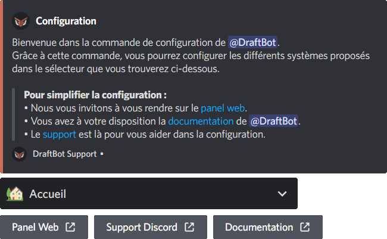

# Configuration guidée

Pour démarrer le processus de configuration, utilisez la commande <mark style="color:orange;">/config</mark>. Vous avez la possibilité, directement dans la commande, de choisir le système que vous souhaitez configurer spécifiquement, ou laisser le deuxième champ libre pour configurer intégralement le bot.\
\
Si vous ne choisissez aucune spécificité, **DraftBot** vous enverra ce message :

<figure><figcaption>
Menu d'accueil de la commande config
</figcaption></figure>


Vous pouvez également utiliser le <mark style="color:yellow;">panneau de configuration</mark> sur le site accessible via la commande <mark style="color:orange;">/panel</mark> ou à l'adresse suivante : [https://draftbot.fr/dashboard](https://draftbot.fr/dashboard)


Choisissez alors dans le <mark style="color:yellow;">sélecteur déroulant</mark>, par défaut réglé sur **Accueil**, la composante de **DraftBot** que vous désirez configurer en premier. Chacune d'entre elle est résumée dans le message de configuration, et paramétrable en utilisant les boutons proposés sous ce dernier. Plus de détails vous sont expliqués dans les chapitres suivants.
