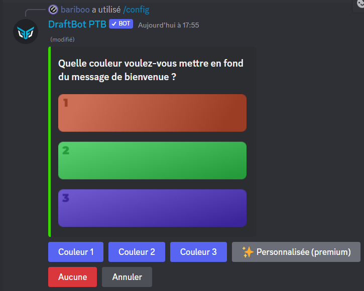
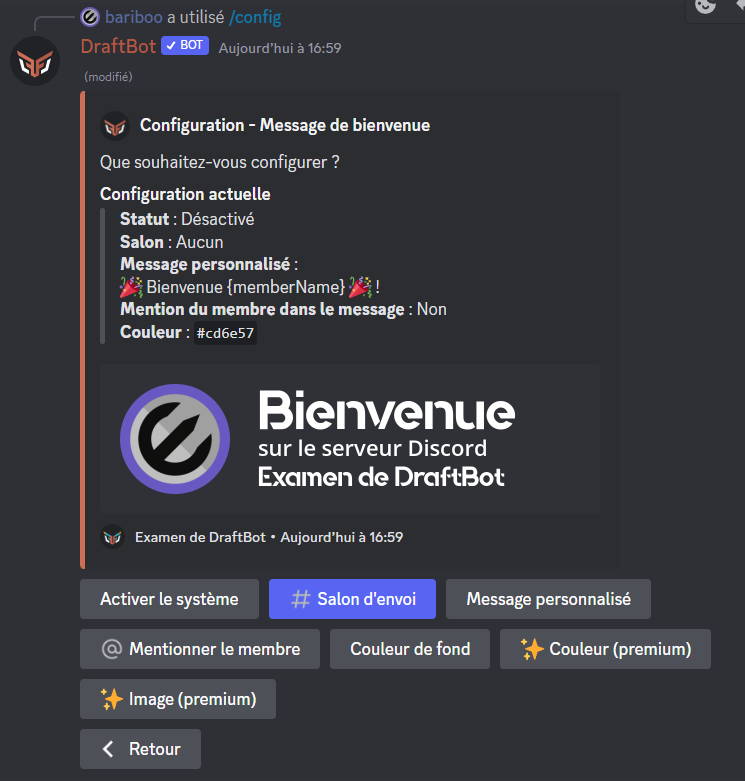
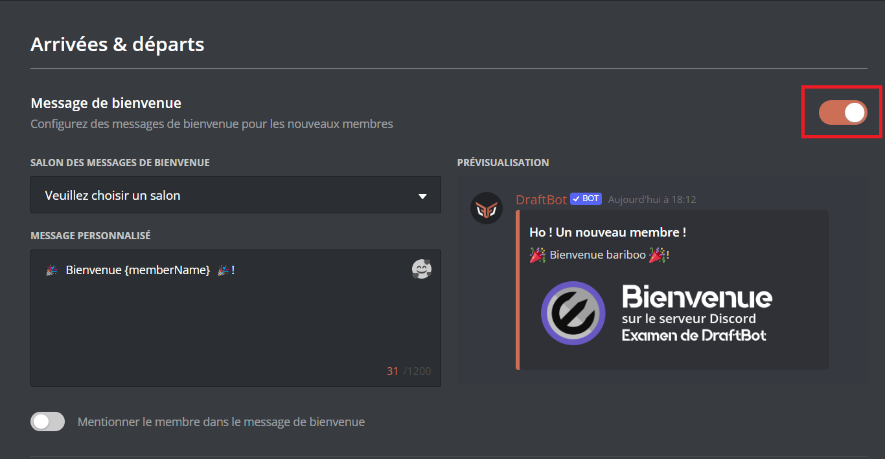
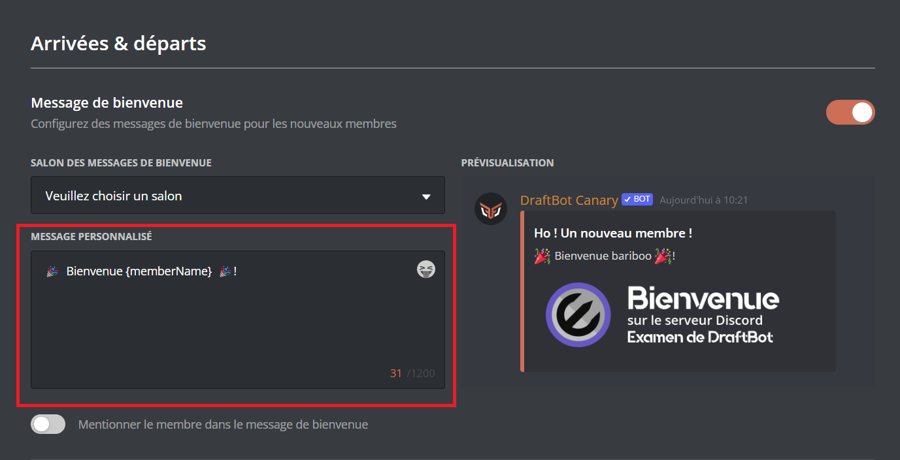
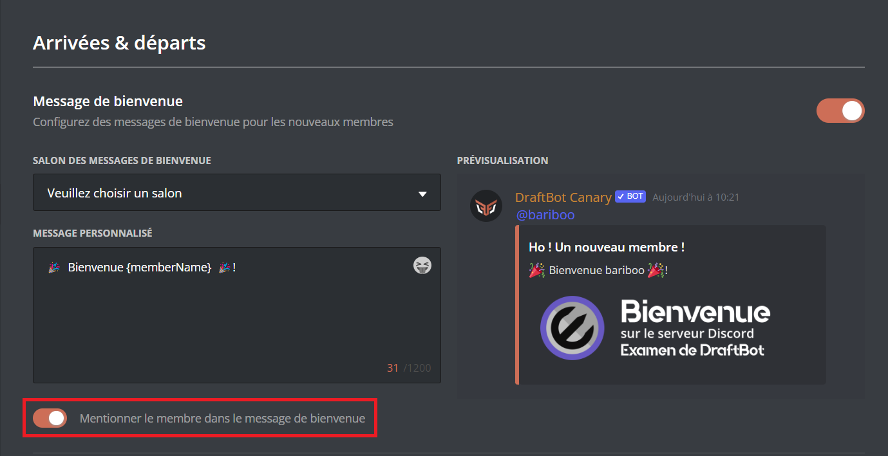
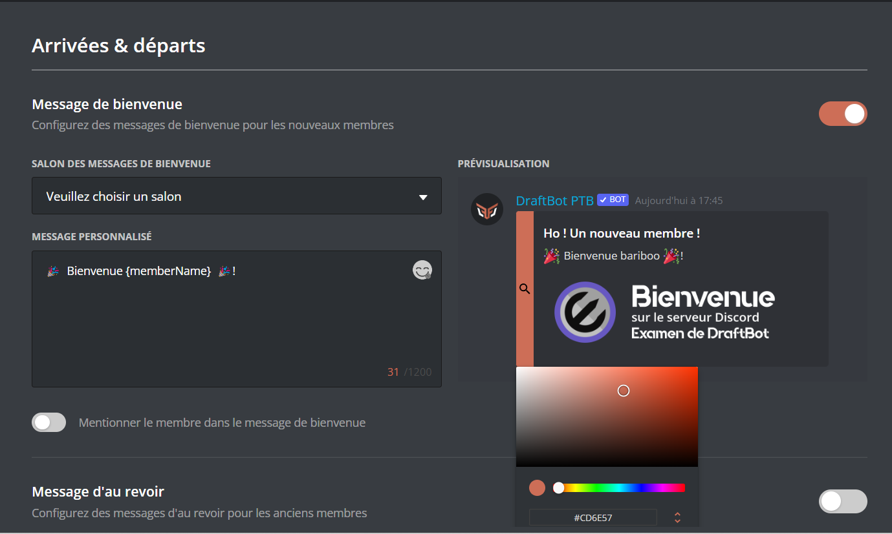

# 👋 Arrivées & départs

## <mark style="color:blue;">Messages de bienvenue</mark>



Veuillez d'abord vous rendre dans <mark style="color:orange;">/config</mark> ➜ 👋
Arrivées & départs ➜ <mark style="color:blue;">"Message de bienvenue"</mark>.

Voici les différents boutons ainsi que leurs utilités :
- "Activer le système" ➜ Permet d'activer ou désactiver le système.
- "<mark style="color:blue;"># Salon d'envoi"</mark> ➜ Définir le salon où le message de bienvenue sera envoyé.
- "Message personnalisé" ➜ Définir le message qui sera envoyé dans le message de bienvenue.
ㅤ

Variables

Les variables sont des bouts de texte qui évoluent suivant la personne, le serveur, le salon ou encore le temps. Voici celles utilisables dans les messages de bienvenue de **Draftbot**.

- `{user}` ➜ Mention du membre
- `{user.id}` ➜ Identifiant du membre
- `{user.username}` ➜ Pseudo du membre
- `{user.nickname}` ➜ Surnom ou pseudo du membre
- `{user.tag}` ➜ Tag du membre _Pseudo#0000_
- `{server}` ➜ Nom du serveur
- `{server.id}` ➜ Identifiant du serveur
- `{server.name}` ➜ Nom du serveur
- `{server.membercount}` ➜ Nombre de membres sur le serveur
- `{channel}` ➜ Mentions du salon
- `{channel.id}` ➜ Identifiant du salon
- `{channel.name}` ➜ Nom du salon
- `{date}` ➜ Date actuelle (JJ/MM/AAAA)
- `{time}` ➜ Heure actuelle (HH:MM)
- `{timestamp}` ➜ Timestamp actuel en secondes

ㅤ

Votre message doit faire au maxiumum 1200 caractères.


ㅤ
- "@ Mentionner le membre" ➜ Une fois cette option activée, le membre sera mentionné dans le message de bienvenue.
- "Couleur de fond" ➜ Permet de modifier la couleur de fond du message de bienvenue.
ㅤ

Vous avez le choix entre trois couleurs ainsi que celui par défaut avec le bouton <mark style="color:red;">"Aucune"</mark>, si vous souhaitez en avoir une personnalisée, vous devez avoir un abonnement <mark style="color:blue;">[premium](https://draftbot.fr/premium)</mark>.
ㅤ

ㅤ

ㅤ
- "Couleur" ➜ Définir la couleur de la barre latérale de votre message de bienvenue. **_([✨ premium](https://draftbot.fr/premium))_**
- "Image" ➜ Permet d'ajouter une image une image de fond à votre message de bienvenue. **_([✨ premium](https://draftbot.fr/premium))_**
ㅤ

Les dimensions optimales de l'image sont de 1000 x 300 pixels.

ㅤ

ㅤ


Veuillez d'abord vous rendre sur le <mark style="color:orange;">[Panel](https://draftbot.fr/dashboard/)</mark> ➜ Arrivées & départs.

### Activer et désactiver le système de Message de bienvenue

Pour activer le système, il vous faut cliquer sur le bouton d'activation du module. Si vous voulez le désactiver, recliquez sur ce même bouton.

### Envoyer le message de bienvenue dans un salon précis

Pour faire cela, cliquez sur le sélecteur intitulé <mark style="color:orange;">Salon des messages de bienvenue</mark>, puis choisissez le salon voulu.

### Modifier le message de bienvenue

Pour modifier le message de bienvenue, rendez-vous dans <mark style="color:orange;">Message personnalisé</mark>. Vous pouvez ensuite modifier le texte à votre guise.

details>

Variables

Les variables sont des bouts de texte qui évoluent suivant la personne, le serveur, le salon ou encore le temps. Voici celles utilisables dans les messages de bienvenue de **Draftbot**.

- `{user}` ➜ Mention du membre
- `{user.id}` ➜ Identifiant du membre
- `{user.username}` ➜ Pseudo du membre
- `{user.nickname}` ➜ Surnom ou pseudo du membre
- `{user.tag}` ➜ Tag du membre _Pseudo#0000_
- `{server}` ➜ Nom du serveur
- `{server.id}` ➜ Identifiant du serveur
- `{server.name}` ➜ Nom du serveur
- `{server.membercount}` ➜ Nombre de membres sur le serveur
- `{channel}` ➜ Mentions du salon
- `{channel.id}` ➜ Identifiant du salon
- `{channel.name}` ➜ Nom du salon
- `{date}` ➜ Date actuelle (JJ/MM/AAAA)
- `{time}` ➜ Heure actuelle (HH:MM)
- `{timestamp}` ➜ Timestamp actuel en secondes

ㅤ
 
 Votre message doit faire au maxiumum 1200 caractères.

ㅤ

ㅤ

### Activer et désactiver la mention du membre à son arrivée

Pour mentionner automatiquement un membre à son arrivée, vous devez activer le module <mark style="color:orange;">Mentionner le membre dans son message de bienvenue</mark>.

### Changer la couleur de fond du message de bienvenue

Si vous voulez modifier la couleur de fond de votre message de bienvenue, rendez vous sur la <mark style="color:orange;">prévisalisuation</mark> puis lorsque vous êtes sur l'image, cliquez sur le bouton "Modifier".
ㅤ
ㅤ

Si vous souhaitez mettre une couleur de votre choix ou définir une image de fond de votre choix, il vous faut être <mark style="color:orange;">[premium](https://draftbot.fr/premium)</mark>.

ㅤ

ㅤ
### Changer la couleur du message de bienvenue.

Pour changer la couleur de l'embed, vous devez survoler la barre de couleur se situant dans la prévisualisation. Vous devez ensuite cliquer sur le signe "rechercher".

### Ajouter ou retirer une image de fond

Si vous voulez modifier la couleur de fond de votre message de bienvenue, rendez vous sur la <mark style="color:orange;">prévisualisation</mark> puis lorsque vous êtes sur l'image, cliquez sur le bouton "Modifier".




## <mark style="color:blue;">Messages d'au revoir</mark>

#### Activer ou désactiver le message d'au revoir

Pour activer le système d'au revoir, il vous suffit de cliquer sur "Activer le système". Si vous souhaitez désactiver le système, il vous suffit de cliquer sur <mark style="color:green;">"Système activé"</mark>.

#### Envoyer le message de d'au revoir dans un salon précis

Pour choisir le salon où le message d'au revoir sera envoyé, il vous suffit de cliquer sur "Salon d'envoi" et d'envoyer ensuite le nom du salon ou son identifiant.

#### Changer le message d'au revoir

Pour changer le message qui sera envoyé quand un membre qui le serveur, il vous suffit de cliquer sur "Message personnalisé", il vous sera possible ensuite d'indiquer le texte.

#### Changer la couleur de fond du message d'au revoir

Pour changer la couleur de fond, il vous suffit de cliquer sur "Couleur de fond", vous aurez alors ensuite le choix entre 3 couleurs ainsi que celui par défaut avec le bouton <mark style="color:red;">"Aucune"</mark>.

### :sparkles: Fonctionnalités premium

#### Changer la couleur de la barre de l'embed

Pour changer la couleur de la barre de l'embed, il vous suffit de cliquer sur le bouton "Couleur (premium)" et ensuite indiquer la couleur en format [HEX](https://htmlcolorcodes.com/) : #XXXXXX

#### Ajouter ou retirer une image de fond

Pour ajouter une image de fond, il vous suffit de cliquer sur "Image (premium)" et d'envoyer ensuite une image. Si vous souhaitez retirer l'image de fond, il vous suffit de cliquer sur "Image (premium)" et d'écrire ensuite _delete_.


(Dimensions optimales de l'image : 1000 x 300 pixels)


