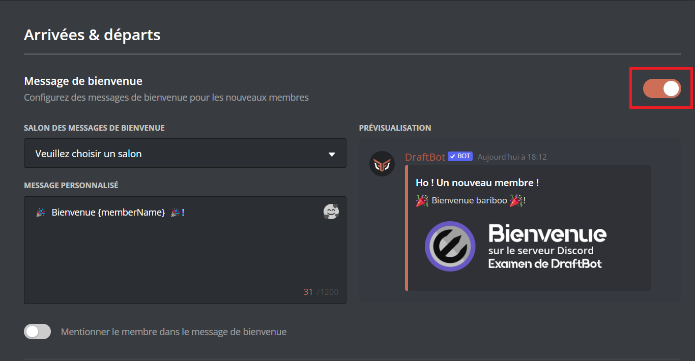
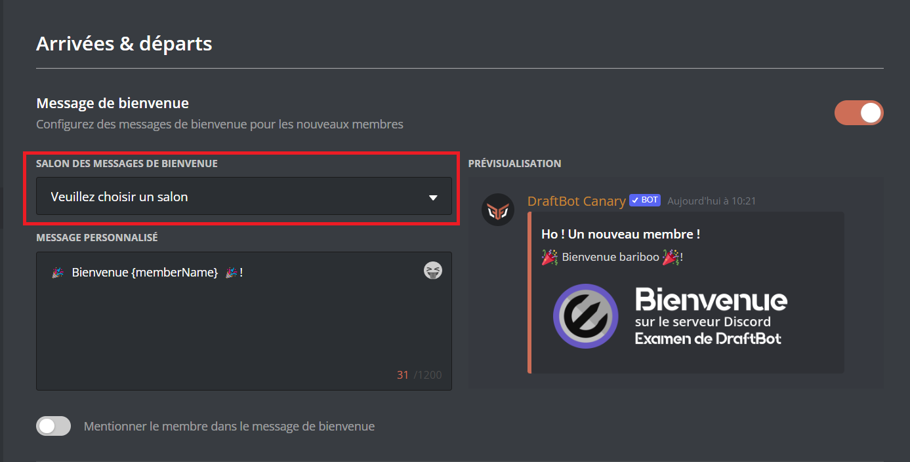
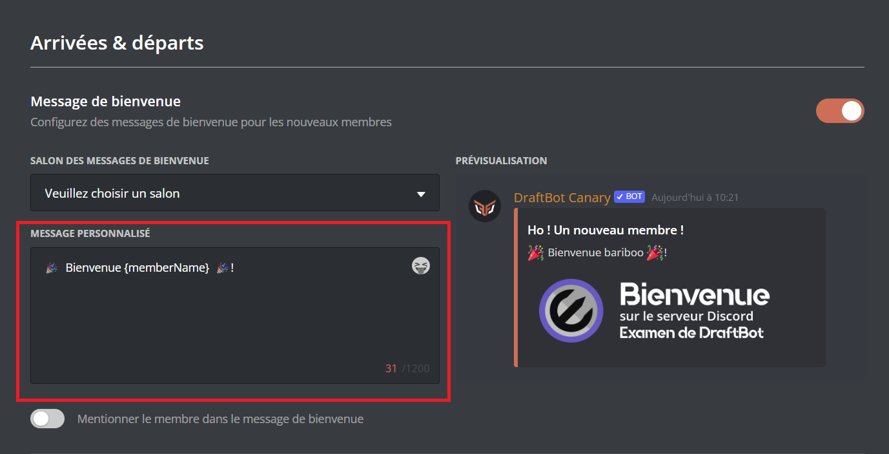
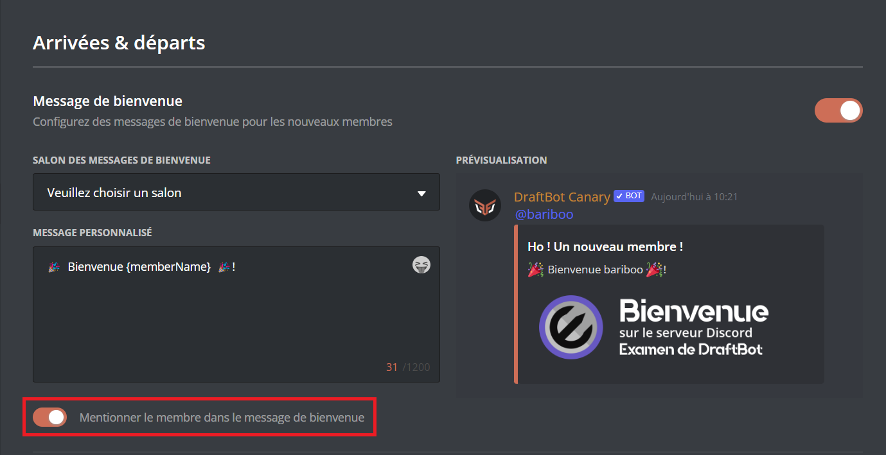
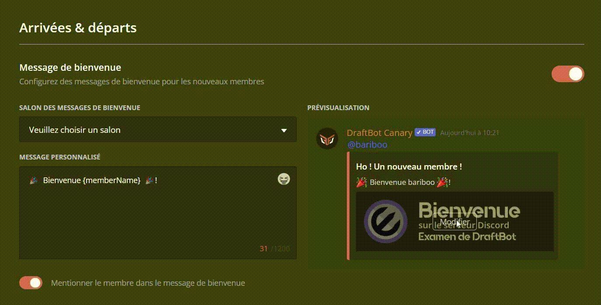

# 👋 Arrivées & départs

## <mark style="color:blue;">Messages de bienvenue</mark>



#### Activer et désactiver le système de Message de bienvenue

Pour activer le système de bienvenue, il vous suffit de cliquer sur "Activer le système". Si vous souhaitez désactiver le système, il vous suffit de cliquer sur <mark style="color:green;">"Système activé"</mark>.

#### Envoyer le message de bienvenue dans un salon précis

Pour choisir le salon où le message de bienvenue sera envoyé, il vous suffit de cliquer sur "Salon d'envoi" et d'envoyer ensuite le nom du salon ou son identifiant.

#### Changer le message de bienvenue

Pour changer le message qui sera envoyé à l'arrivé d'un membre, il vous suffit de cliquer sur "Message personnalisé", il vous sera possible ensuite d'indiquer le texte.

#### Activer et désactiver la mention du membre à son arrivé

Pour mentionner un membre à son arrivé, il vous suffit de cliquer sur "Mentionner le membre". Si vous souhaitez désactiver la mention du membre à son arrivé, vous pouvez cliquer sur <mark style="color:green;">"Mention activée"</mark>.

#### Changer la couleur de fond du message de bienvenue

Pour changer la couleur de fond, il vous suffit de cliquer sur "Couleur de fond", vous aurez alors ensuite le choix entre 3 couleurs ainsi que celui par défaut avec le bouton <mark style="color:red;">"Aucune"</mark>.



Veuillez d'abord vous rendre sur le <mark style="color:orange;">"[Panel](https://draftbot.fr/dashboard/)"</mark> ➜ Arrivées & départs.

#### Activer et désactiver le système de Message de bienvenue

Pour activer le système, il vous faut cliquer sur le bouton d'activation du module. Si vous voulez le désactiver, recliquer sur ce même bouton.



#### Envoyer le message de bienvenue dans un salon précis

Pour faire cela, cliquez sur le sélecteur intitulé <mark style="color:orange;">"Salon des messages de bienvenue"</mark> puis choisissez le salon voulut.

#### Changer le message de bienvenue

Pour modifier le message de bienvenue rendez - vous dans <mark style="color:orange;">"Message personnalisé"</mark>. Vous pouvez ensuite modifier le texte à votre guise.
ㅤ
 
Les variables pour personnaliser vos messages peuvent être utilisées. Votre message doit faire au maxiumum 1200 caractères.

ㅤ

#### Activer et désactiver la mention du membre à son arrivé

Pour mentionner automatiquement un membre à son arrivé, il vous faut activer le module "Mentionner le membre dans son message de bienvenue".

#### Changer la couleur de fond du message de bienvenue

Si vous voulez modifier la couleur de fond de votre message de bienvenue, allez dans la prévisalisation puis lorsque vous êtes sur l'image, cliquer sur le bouton "Modifier".
ㅤ

Si vous souhaitez mettre une couleur de votre choix ou avoir la possibilitée d'upload une image de votre choix, il vous faut être <mark style="color:orange;">"[premium](https://draftbot.fr/premium)"</mark>.

ㅤ







#### Changer la couleur de la barre de l'embed

Pour changer la couleur de la barre de l'embed, il vous suffit de cliquer sur le bouton "Couleur (premium)" et ensuite indiquer la couleur en format <mark style="color:orange;">"[HEX](https://htmlcolorcodes.com/)"</mark> : #XXXXXX

#### Ajouter ou retirer une image de fond

Pour ajouter une image de fond, il vous suffit de cliquer sur "Image (premium)" et d'envoyer ensuite une image. Si vous souhaitez retirer l'image de fond, il vous suffit de cliquer sur "Image (premium)" et d'écrire ensuite _delete_.
ㅤ

(Dimensions optimales de l'image : 1000 x 300 pixels)

ㅤ


#### Changer la couleur de la barre de l'embed

Pour changer la couleur de la barre de l'embed, vous devez survoler la barre de couleur sur la prévisualisation de cliquer sur l'icône rechercher.

#### Ajouter ou retirer une image de fond

Pour ajouter une image de fond à votre message de bienvenue, allez dans la prévisalisation puis lorsque vous êtes sur l'image, cliquer sur le bouton "Modifier" 





## <mark style="color:blue;">Messages d'au revoir</mark>

#### Activer ou désactiver le message d'au revoir

Pour activer le système d'au revoir, il vous suffit de cliquer sur "Activer le système". Si vous souhaitez désactiver le système, il vous suffit de cliquer sur <mark style="color:green;">"Système activé"</mark>.

#### Envoyer le message de d'au revoir dans un salon précis

Pour choisir le salon où le message d'au revoir sera envoyé, il vous suffit de cliquer sur "Salon d'envoi" et d'envoyer ensuite le nom du salon ou son identifiant.

#### Changer le message d'au revoir

Pour changer le message qui sera envoyé quand un membre qui le serveur, il vous suffit de cliquer sur "Message personnalisé", il vous sera possible ensuite d'indiquer le texte.

#### Changer la couleur de fond du message d'au revoir

Pour changer la couleur de fond, il vous suffit de cliquer sur "Couleur de fond", vous aurez alors ensuite le choix entre 3 couleurs ainsi que celui par défaut avec le bouton <mark style="color:red;">"Aucune"</mark>.

### :sparkles: Fonctionnalités premium

#### Changer la couleur de la barre de l'embed

Pour changer la couleur de la barre de l'embed, il vous suffit de cliquer sur le bouton "Couleur (premium)" et ensuite indiquer la couleur en format [HEX](https://htmlcolorcodes.com/) : #XXXXXX

#### Ajouter ou retirer une image de fond

Pour ajouter une image de fond, il vous suffit de cliquer sur "Image (premium)" et d'envoyer ensuite une image. Si vous souhaitez retirer l'image de fond, il vous suffit de cliquer sur "Image (premium)" et d'écrire ensuite _delete_.


(Dimensions optimales de l'image : 1000 x 300 pixels)


