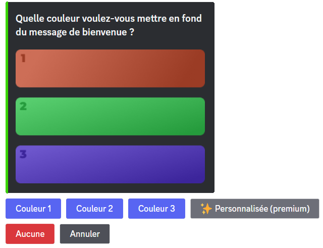
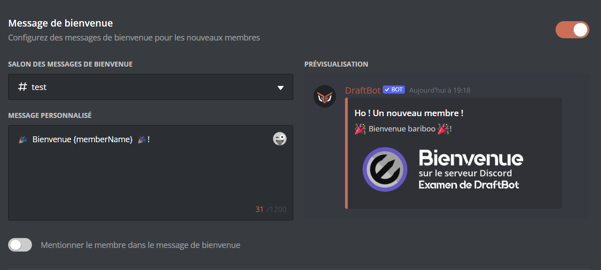

# 👋 Arrivées & départs

## <mark style="color:blue;">Messages de bienvenue</mark>



Veuillez d'abord vous rendre dans la commande <mark style="color:orange;">/config</mark> ➜ 👋
Arrivées & départs ➜ "<mark style="color:blue;">Message de bienvenue</mark>".

Voici les différents boutons ainsi que leurs utilités :
- "Activer le système" ➜ Permet d'activer ou désactiver le système.
"<mark style="color:blue;">Salon d'envoi</mark>" ➜ Définir le salon où le message de bienvenue sera envoyé.

- "Message personnalisé" ➜ Définir le message qui sera envoyé dans le message de bienvenue.
ㅤ

Variables

Les variables sont des bouts de texte qui évoluent suivant la personne, le serveur, le salon ou encore le temps. Voici celles utilisables dans les messages de bienvenue de DraftBot.

- `{user}` ➜ Mention du membre
- `{user.id}` ➜ Identifiant du membre
- `{user.username}` ➜ Pseudo du membre
- `{user.nickname}` ➜ Surnom ou pseudo du membre
- `{user.tag}` ➜ Tag du membre _(Pseudo#0000)_
- `{server}` ➜ Nom du serveur
- `{server.id}` ➜ Identifiant du serveur
- `{server.name}` ➜ Nom du serveur
- `{server.membercount}` ➜ Nombre de membres sur le serveur
- `{channel}` ➜ Mentions du salon
- `{channel.id}` ➜ Identifiant du salon
- `{channel.name}` ➜ Nom du salon
- `{date}` ➜ Date actuelle (JJ/MM/AAAA)
- `{time}` ➜ Heure actuelle (HH:MM)
- `{timestamp}` ➜ Timestamp actuel en secondes

ㅤ

Votre message doit faire au maximum 1 200 caractères.


ㅤ
- "Mentionner le membre" ➜ Une fois cette option activée, le membre sera mentionné dans le message de bienvenue.
- "Couleur de fond" ➜ Permet de modifier la couleur de fond du message de bienvenue.
ㅤ

Vous avez le choix entre trois couleurs ainsi que celle par défaut (avec le bouton "<mark style="color:red;">Aucune</mark>").

Si vous souhaitez en avoir une personnalisée, vous devez avoir un abonnement <mark style="color:blue;">[premium](https://draftbot.fr/premium)</mark>.

ㅤ

ㅤ

ㅤ
- "Couleur" ➜ Définir la couleur de la barre latérale de votre message de bienvenue. **_([✨ premium](https://draftbot.fr/premium))_**
- "Image" ➜ Permet d'ajouter une image de fond à votre message de bienvenue. **_([✨ premium](https://draftbot.fr/premium))_**
ㅤ

Les dimensions optimales de l'image sont de 1000 x 300 pixels.

ㅤ

ㅤ


Veuillez d'abord vous rendre sur le <mark style="color:orange;">[panel de **DraftBot**](https://draftbot.fr/dashboard/)</mark> ➜ Arrivées & départs.

Vous devez d'abord activer le système en cliquant sur le bouton d'activation du module. Si vous voulez le désactiver, recliquez sur ce même bouton.

> ⚠️ Une fois fini, n'oubliez pas d'enregistrer vos modifications avec le bouton "Enregistrer" en bas de la page.




## <mark style="color:blue;">Messages d'au revoir</mark>



Veuillez d'abord vous rendre dans la commande <mark style="color:orange;">/config</mark> ➜ 👋
Arrivées & départs ➜ "<mark style="color:blue;">Message d'au revoir</mark>".

Voici les différents boutons ainsi que leurs utilités :
- "Activer le système" ➜ Permet d'activer ou désactiver le système.
"<mark style="color:blue;">Salon d'envoi</mark>" ➜ Définir le salon où le message de bienvenue sera envoyé.

- "Message personnalisé" ➜ Définir le message qui sera envoyé dans le message de bienvenue.
ㅤ

Variables

Les variables sont des bouts de texte qui évoluent suivant la personne, le serveur, le salon ou encore le temps. Voici celles utilisables dans les messages de bienvenue de DraftBot.

- `{user}` ➜ Mention du membre
- `{user.id}` ➜ Identifiant du membre
- `{user.username}` ➜ Pseudo du membre
- `{user.nickname}` ➜ Surnom ou pseudo du membre
- `{user.tag}` ➜ Tag du membre _(Pseudo#0000)_
- `{server}` ➜ Nom du serveur
- `{server.id}` ➜ Identifiant du serveur
- `{server.name}` ➜ Nom du serveur
- `{server.membercount}` ➜ Nombre de membres sur le serveur
- `{channel}` ➜ Mentions du salon
- `{channel.id}` ➜ Identifiant du salon
- `{channel.name}` ➜ Nom du salon
- `{date}` ➜ Date actuelle (JJ/MM/AAAA)
- `{time}` ➜ Heure actuelle (HH:MM)
- `{timestamp}` ➜ Timestamp actuel en secondes

ㅤ

Votre message doit faire au maximum 1 200 caractères.

ㅤ
- "Couleur de fond" ➜ Permet de modifier la couleur de fond du message de bienvenue.
ㅤ

Vous avez le choix entre trois couleurs ainsi que celle par défaut (avec le bouton "<mark style="color:red;">Aucune</mark>"). 

Si vous souhaitez en avoir une personnalisée, vous devez avoir un abonnement <mark style="color:blue;">[premium](https://draftbot.fr/premium)</mark>.
ㅤ

ㅤ

ㅤ
- "Couleur" ➜ Définir la couleur de la barre latérale de votre message de bienvenue. **_([✨ premium](https://draftbot.fr/premium))_**
- "Image" ➜ Permet d'ajouter une image de fond à votre message de bienvenue. **_([✨ premium](https://draftbot.fr/premium))_**
ㅤ

Les dimensions optimales de l'image sont de 1000 x 300 pixels.

ㅤ



Veuillez d'abord vous rendre sur le <mark style="color:orange;">[panel](https://draftbot.fr/dashboard)</mark> de **DraftBot** ➜ Arrivées & départs.

Vous devez d'abord activer le système en cliquant sur le bouton d'activation du module. Si vous voulez le désactiver, recliquez sur ce même bouton.

> ⚠️ Une fois fini, n'oubliez pas d'enregistrer vos modifications avec le bouton "Enregistrer" en bas de la page.

