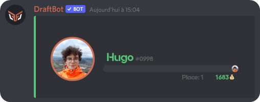
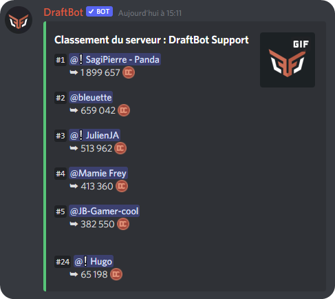

# Economie

## Afficher le nombre d'argent

Vous pouvez afficher le nombre d'argent virtuel d'un membre sous forme d'image.

### La carte d'un membre

* Vous pouvez afficher votre carte à l'aide de la commande `/money`.
* Dans le cas où vous souhaitez afficher la carte d'un membre, il vous suffit de faire la même commande `/money membre:<Le_membre>`.


Pour représenter un membre pour n'importe quelle commande de **DraftBot**, vous pouvez utiliser son **identifiant** et sa **mention**.


### Le classement du serveur

Dans le cas où vous souhaitez afficher le classement d'argent du serveur, il vous suffit de faire la commande `/topmoney`.


Dans le cas où vous ne faites pas partie du top 5, vous serez tout de même affiché en dessous avec votre place.


## Membre

### Donner de l'argent

Vous avez la possibilité de donner de l'argent à un autre membre avec la commande `!pay <membre> <nombre> <raison>`


Pour représenter un membre pour n'importe quelle commande de **DraftBot**, vous pouvez utiliser son [**identifiant**](../../autres/recuperer-un-identifiant.md#membre), son **pseudo**, son **tag**, son **pseudo sur le serveur**, son **pseudo partiellement**, et sa **mention**.


### Acheter un article

Vous pouvez acheter un article présent dans la boutique du serveur avec la commande `shop`. Cela affichera la boutique du serveur et vous aurez la possibilité d'acheter un article via le sélecteur en-dessous du message.

## Configuration

Vous pouvez l'activer, la désactiver, modifier son intensité, l’ignorer, la booster, la personnaliser ou encore la réinitialiser avec la commande `!admineconomy` ou `@DraftBot#0535 admineconomy`.&#x20;

Un message vous sera envoyé par **DraftBot** pour savoir si vous voulez :

* `on` → Activer le système
* `off` → Désactiver le système
* `config` → Le configurer
* `boosters` → Multiplier les gains d'argent d’un rôle
* `ignore` → Ne pas prendre en compte un rôle ou salon&#x20;
* `reset` → Réinitialiser la fonctionnalité (`adminmoney resetall` pour réinitialiser l'économie)
* `color` → Personnaliser la couleur (fonctionnalité réservée aux [premiums](https://www.draftbot.fr/premium))

### **Modifier le gain d'argent et configurer l'argent quotidien** 

Si vous choisissez de **modifier le gain d'argent et configurer l'argent quotidien**, en envoyant `config`, vous aurez alors le choix pour **modifier le gain d'argent** entre quatre propositions : 0, entre 5 et 15, entre 15 et 25 et entre 25 et 35.\
\
Le taux actuel est symbolisé par le bouton en vert. Cliquez alors sur le bouton de votre choix, en fonction du taux d’expérience que vous souhaitez à présent faire gagner.&#x20;

Pour **configurer l'argent quotidien,** vous aurez le choix de l'argent à faire gagner lors de l'exécution de la commande `daily`.


Si vous ne souhaitez pas activer cette fonctionnalité, il vous suffira d'envoyer 0 pendant la configuration de l'argent quotidien.


### **Multiplier le gain d’un rôle** 

Si vous choisissez de **booster le gain d'argent d'un rôle**, en envoyant `boosters`, vous aurez alors le choix entre trois propositions : Ajouter un rôle booster | Supprimer un rôle booster | Afficher les rôles boosters

* Si vous choisissez d’ajouter un rôle booster, vous devrez choisir quel rôle doit être boosté. Vous pourrez ensuite choisir le multiplicateur entre `1.5`, `2.0`, `2.5` ou `3.0`.
* Si vous choisissez de supprimer un rôle booster, DraftBot vous montrera tous les rôles boostés et vous devrez alors choisir lequel supprimer.
* Si vous choisissez d’afficher la liste des rôles boosters, DraftBot vous enverra tous les rôles boostés et le multiplicateur qui leur a été attribué.

### Ignorer un salon ou un rôle

Si vous choisissez d’**ignorer le gain d'argent**, en envoyant `ignore`, vous aurez le choix entre deux propositions : Ignorer un rôle | Ignorer un salon&#x20;

* Si vous choisissez le rôle, vous devez renseigner le rôle qui empêchera les membres l'ayant de gagner de l’argent.&#x20;
* Si vous choisissez le salon, vous devez renseigner le salon dans lequel le gain d'argent ne sera pas comptabilisé.

### Réinitialiser la configuration

Si vous choisissez de **réinitialiser la configuration** du système de niveaux, en envoyant `reset`, vous n’aurez rien à faire de plus, **DraftBot** vous supprimera toutes les configurations effectuées pour ce système, à savoir :

* Son statut
* Le nombre d'argent donné lors de l'arrivée d'un membre
* Le nombre d'argent gagné à chaque message
* Le statut qui empêche les membres invisibles de gagner de l’expérience
* Les rôles qui empêchent le gain d'argent
* Les salons dans lesquels le gain d'argent est désactivé
* Les rôles qui permettent de multiplier le gain d'argent
* La couleur de la fonctionnalité d'argent (fonctionnalité réservée aux [premiums](https://www.draftbot.fr/premium))

### Modifier la couleur

Si vous choisissez de **modifier la couleur**, en envoyant `color` (fonctionnalité réservée aux [premiums](https://www.draftbot.fr/premium)), il vous suffira de renseigner un code hexadécimal (il s’agit d’une série de 6 chiffres et lettres représentant une couleur). Voici un sélecteur pour choisir vos couleurs : [htmlcolorcodes.com](https://htmlcolorcodes.com/)

## Boutique

Vous pouvez ajouter, retirer, modifier un article ou encore réinitialiser la boutique avec la commande `!adminshop` ou `@DraftBot#0535 adminshop`.&#x20;

Un message vous sera envoyé par **DraftBot** pour savoir si vous voulez :

* `add` → Ajouter un article
* `remove` → Supprimer un article
* `update` → Modifier un article
* `config` → Configurer la boutique
* `reset` → Réinitialiser la boutique

### Ajouter un article

Si vous choisissez d'ajouter un article à votre boutique, en envoyant `add`, vous aurez la possibilité d'ajouter :&#x20;

* Un rôle / rôle temporaire
* De l'expérience (niveaux)
* Récompense personnalisée (envoie un message à l'administrateur)
* Objet d'inventaire

Vous aurez ensuite la possibilité d'ajouter une description et un prix à votre article.

### Modifier un article

Si vous choisissez de modifier un article déjà existant, en envoyant `update`, vous devrez alors choisir un article parmi la liste envoyée.\
\
Vous pourrez alors modifier l'article, la description ou le prix de l'objet.

### Configurer la boutique

Si vous choisissez de configurer la boutique, en envoyant `config`, vous aurez la possibilité de choisir entre deux types de boutique :&#x20;

* Boutique normale : le message du `shop` est conservé.
* Marché noir : le message du `shop` est supprimé au bout de 60 secondes.

### Réinitialiser la boutique

Si vous choisissez de réinitialiser la boutique, en envoyant `reset`, tous les articles de votre boutique seront réinitialisés.


Les récompenses déjà données aux membres ayant payé l'article **ne leur seront pas retirées** !

