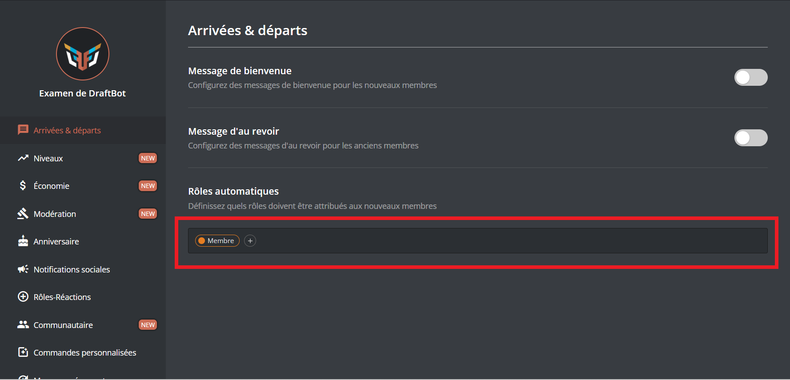
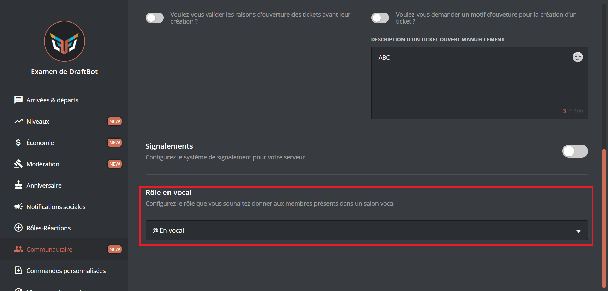

# 🏷 Rôles automatiques

## <mark style="color:blue;">A l'arrivée</mark>

#### Ajouter ou retirer un rôle attribué à l'arrivée



Veuillez d'abord vous rendre dans <mark style="color:orange;">/config</mark> ➜ 🏷️ Rôles Automatiques ➜ <mark style="color:blue;">"À l'arrivée"</mark>.

Pour ajouter un rôle automatique à l'arrivée d'un membre, vous pouvez cliquer sur "Ajouter".

Par contre si souhaitez retirer un rôle donné lorsqu'un membre rejoint votre serveur, vous pouvez cliquer sur "Retirer".

Si vous souhaitez par contre retirer **tous** les rôles automatiques à l'arrivée, cliquez sur "Réinitialiser".


La limite des rôles automatiques est de 3 pour les serveurs non-premium et 10 pour les serveurs premiums.





Veuillez d'abord vous rendre sur le [<mark style="color:orange;">panel</mark>](https://draftbot.fr/dashboard/user/) ➜ Arrivées & départs ➜ Bas de la page.

Sélectionnez ensuite le rôle que vous souhaitez rendre automatique à l'arrivée d'un nouveau membre.


Si les rôles apparaissent en rouge, cela signifie que DraftBot n'a pas les permissions de donner ce rôle ou bien que ce dernier est en dessous des rôles que l'on souhaite attribuer.





## <mark style="color:blue;">En vocal</mark>

#### Ajouter ou retirer un rôle attribué lorsqu'un membre est en vocal



Veuillez d'abord vous rendre dans <mark style="color:orange;">/config</mark> ➜ 🏷️ Rôles Automatiques ➜ <mark style="color:blue;">"En vocal"</mark>.

Pour ajouter un rôle automatique à un membre en vocal, vous pouvez cliquer sur "Configurer".
*Vous avez la possibilité de sélectionner un rôle déjà existant ou d'en créer un directement.*

Pour retirer un rôle automatique à l'arrivée d'un membre, vous pouvez cliquer sur "Modifier".
*Vous avez la possibilité de supprimer le rôle du serveur une fois le système désactivé.*

#### Restreindre des salons aux membres en vocal

Pour restreindre des salons aux membres en vocal, cliquez sur "Restreindre des salons aux membres en vocal" puis sélectionnez le salon en question. Seuls les membres possédant ce rôle pourront le voir.

](../../.gitbook/assets/autorole/voice.png)



Veuillez d'abord vous rendre sur le [<mark style="color:orange;">panel</mark>](https://draftbot.fr/dashboard/user/) ➜ Communautaire ➜ Bas de la page.

Sélectionnez ensuite le rôle que vous souhaitez rendre automatique à l'arrivée d'un nouveau membre.


Si les rôles apparaissent en rouge, cela signifie que DraftBot n'a pas les permissions de donner ce rôle ou bien que ce dernier est en dessous des rôles que l'on souhaite attribuer.





## <mark style="color:blue;">En live</mark>

Les rôles automatiques de live vous permettent de donner un rôle à un membre lorsqu'il est en direct sur YouTube ou encore sur Twitch.

Veuillez d'abord vous rendre dans <mark style="color:orange;">/config</mark> ➜ 🏷️ Rôles Automatiques ➜ <mark style="color:blue;">"En live"</mark>.

Pour ajouter un rôle automatique à un membre en live, vous pouvez cliquer sur "Configurer".
*Vous avez la possibilité de sélectionner un rôle déjà existant ou d'en créer un nouveau.*

#### Restreindre un rôle de live à certains utilisateurs

Vous pouvez autoriser **DraftBot** à donner le rôle de live au membre uniquement s'il en possède un autre. Pour faire cela, cliquez sur le bouton "Restreindre le rôle".

Si vous souhaitez retirer cette restriction, cliquez de nouveau sur "Restreindre le rôle" puis "Retirer".
*Vous avez également la possibilité de les réinitialiser.*

