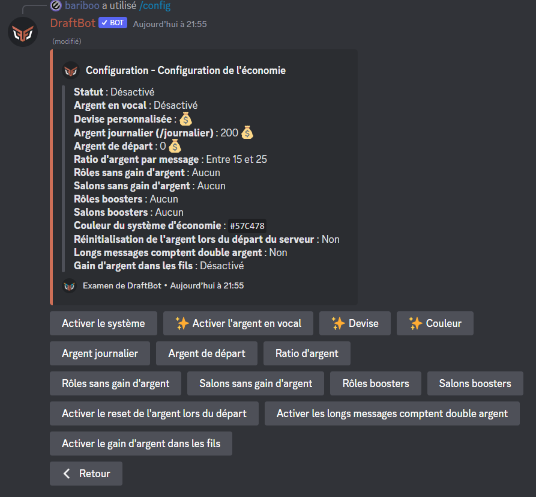
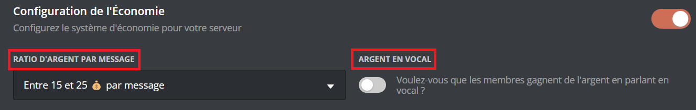
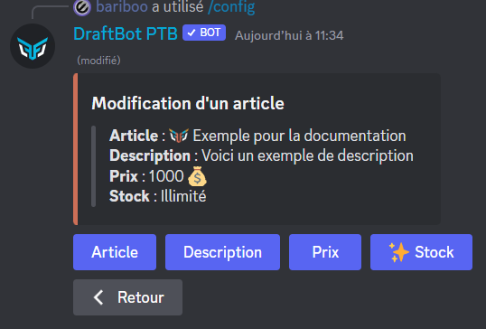
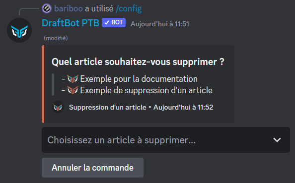
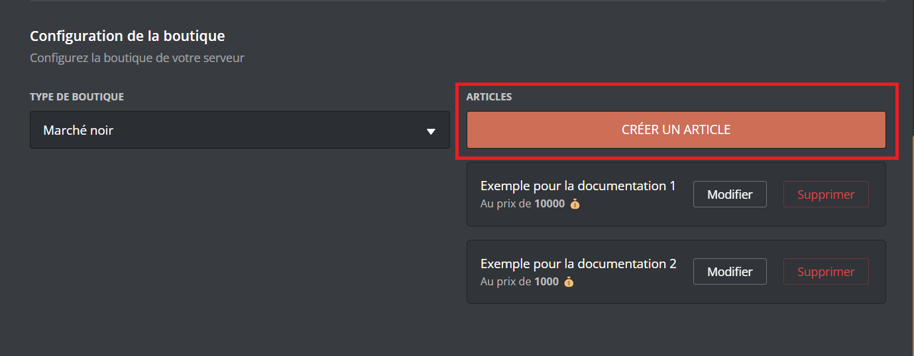
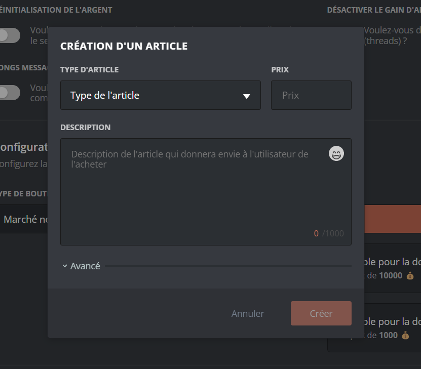
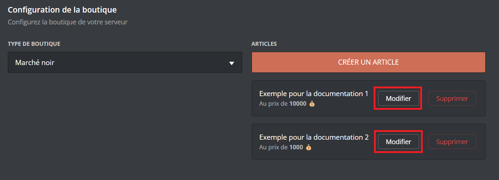
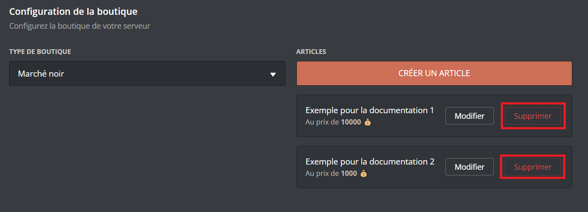
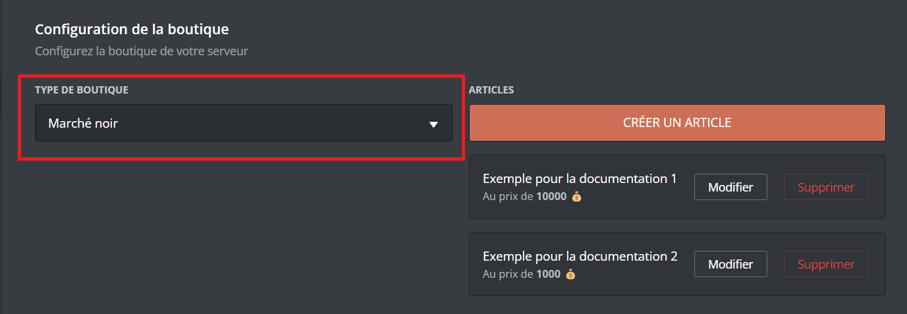

# Gestion de l'économie

## Votre Argent

Vous pouvez voir votre somme d'argent, ainsi que celle des autres membres en indiquant leur pseudo dans l'argument "Membre" avec <mark style="color:orange;">/argent \[membre]</mark>. Pour d'obtenir de l'argent, il faut que [le système d'économie](https://docs.draftbot.fr/slash/configuration/economie) soit activé sur le serveur.

- <mark style="color:orange;">/journalier</mark> ➜ Commande journalière permettant de gagner un montant défini au préalable par les administrateurs.
- <mark style="color:orange;">/payer</mark> ➜ Donner de l'argent à un membre de votre choix.


Il vous faut d'abord configurer ce système.


## Modifier l'argent des utilisateurs

Il existe plusieurs commandes pour gérer l'argent de vos membres :

- <mark style="color:orange;">/adminargent ajouter</mark> ➜ Ajouter de l'argent à un membre en plus de son montant actuel.
- <mark style="color:orange;">/adminargent définir</mark> ➜ Définir l'argent d'un membre en ne tenant pas compte de son montant actuel.
- <mark style="color:orange;">/adminargent retirer</mark> ➜ Retirer de l'argent à un membre en se basant sur le montant actuel.
- <mark style="color:orange;">/adminargent réinitialiser serveur</mark> ➜ Remettre à zéro l'argent de tout le serveur.
- <mark style="color:orange;">/dropargent</mark> ➜ Créer un message qui offre de l'argent au premier qui clique sur le bouton.

## Classement

Grâce à la commande <mark style="color:orange;">/topargent</mark> vous avez accès au classement économique du serveur. Vous y verrez les cinq premiers membres ainsi que votre position. Pour voir l'ensemble du classement, cliquez sur le bouton **"Voir l'ensemble du classement"** situé sous le message de **DraftBot**.

## Boutique

Vous pouvez dans la boutique acheter des rôles (temporaire ou non), de l'expérience, des objets d'inventaire ou des articles personnalisés.
Elle est accessible avec la commande <mark style="color:orange;">/boutique</mark>\.


Le marché noir est une variante de la boutique consistant à se supprimer au bout de 60 secondes d'inactivité, ni vu ni connu ! Plus d'informations [ici](https://docs.draftbot.fr/slash/economie#typedelaboutique)



## Objets d'inventaire

Vous avez la possibilité avec **DraftBot** de pouvoir animer la vie du serveur avec des objets d'inventaire. Une fois achetés ou gagnés, vous pouvez effectuer les commandes :
- <mark style="color:orange;">/item échanger</mark> ➜ Échanger un de ses objets d'inventaire avec la personne de son choix.
- <mark style="color:orange;">/item donner</mark> ➜ Donner un de ses objets d'inventaire à la personne de son choix.
- <mark style="color:orange;">/item drop</mark> ➜ Offrir un de ses items à la personne qui appuiera sur le bouton en premier.
- <mark style="color:orange;">/item vendre</mark> ➜ Vendre un de ses objets d'inventaire à la personne de son choix.
- <mark style="color:orange;">/concours créer item</mark> ➜ Faire gagner un item via un giveaway.
- <mark style="color:orange;">/dropitem</mark> ➜ Générer un message qui offre un item au premier qui clique sur le bouton.

# Configuration

Depuis le <mark style="color:blue;">[panel](https://draftbot.fr/dashboard)</mark> ou depuis la commande <mark style="color:orange;">/config</mark>, vous pouvez configurer le système d'économie. 

Vous aurez la possibilité de configurer :

- [Le système d'économie](https://docs.draftbot.fr/modules/configuration/economie#systeme-deconomie)
- [La configuration de la boutique](https://docs.draftbot.fr/modules/configuration/economie#configuration-de-la-boutique)

*Retrouvez le détail de la configuration ci-dessous.*

## Système d'économie




Voici les différents boutons ainsi que leurs utilités :

- "**Activer le système**" ➜ Permet d'activer ou désactiver le système.
- "**Activer l'argent en vocal**" ➜ Une fois activé, les membres pourront gagner de l'argent en vocal. ***(✨ premium)***
ㅤ

Conditions : être plus de deux humains dans le salon vocal ; le salon vocal ne doit pas être paramétré comme "AFK" ; avoir un micro actif.

ㅤ
- "**Devise**" ➜ Permet de définir l'émoji symbolisant la monnaie du serveur. ***(✨ premium)***
- "**Couleur**" ➜ Paramétrer une couleur pour tout le système d'économie. ***(✨ premium)***
- "**Argent journalier**" ➜ Permet de définir l'argent que vos membres pourront gagner chaque jour via la commande <mark style="color:orange;">/journalier</mark>.
- "**Argent de départ**" ➜ Une fois activé, vous pourrez de définir l'argent qu'auront vos membres à leur arrivée sur le serveur.
- "**Ratio d'argent**" ➜ Permet de définir la quantité d'argent gagnée par message.
- "**Rôles sans gain d'argent**" ➜ Permet de définir les rôles qui ne gagneront pas d'argent.
- "**Salons sans gain d'argent**" ➜ Permet de définir les salons où les membres ne gagneront pas d'argent.
- "**Rôles boosters**" ➜ Permet de donner plus d'argent à un membre s'il possède un certain rôle.
- "**Salons boosters**" ➜ Permet de donner plus d'argent à un membre s'il envoie son message dans un certain salon.
- "**Activer le reset de l'argent lors du départ**" ➜ Une fois activé, les membres perdront toute leur argent s'ils quittent le serveur.
- "**Activer les longs messages comptent double argent**" ➜ Si un de vos membres fait un message de plus de 250 caractères, il gagnera le double d'expérience.
- "**Activer le gain d'argent dans les fils**" ➜ Une fois cette option activée, vos membres pourront gagner de l'argent dans les fils et posts.





<mark style="color:blue;">Accéder au [panel](https://draftbot.fr/dashboard) de **DraftBot**</mark>

Une fois sur le panel de **DraftBot** (accessible depuis le lien ci-dessus), rendez-vous sur la page <mark style="color:orange;">"Économie"</mark>.

Si vous ne voyez aucune option, c'est normal car il vous faut activer le système en cliquant sur le bouton d'activation du module. Si vous voulez le désactiver, recliquez sur ce même bouton.

Comme vous l'avez peut être remarqué, les sous-catégories (voir image) sont les mêmes que sur la commande <mark style="color:orange;">/config</mark>. Vous pouvez donc vous rendre dans l'onglet `(Via la commande /config)` pour comparer les options de configuration.


Une fois fini, n'oubliez pas d'enregistrer vos modifications avec le bouton "Enregistrer" en bas de la page.





## Configuration de la boutique




Rendez-vous d'abord dans la catégorie "💰 Économie" de la commande <mark style="color:orange;">/config</mark> puis appuyez sur <mark style="color:blue;">"Configuration de la boutique"</mark>

### Créer un article dans votre boutique
Une fois le bouton <mark style="color:blue;">"Créer"</mark> cliqué un menu va s'ouvrir :

- <mark style="color:blue;">"Rôle"</mark> ➜ Vos membres pourront acheter un rôle prédéfini.
- <mark style="color:blue;">"Rôle temporaire"</mark> ➜ Vos membres pourront acheter un rôle prédéfini qu'ils garderont durant une durée choisie.
- <mark style="color:blue;">"Expérience"</mark> ➜ Vos membres pourront acheter de l'expérience (plus d'information [ici](https://docs.draftbot.fr/modules/niveaux))
- <mark style="color:blue;">"Personnaliser"</mark> ➜ Créer une récompense personnalisée (quelque chose que **DraftBot** ne peut pas offrir).
ㅤ 

Un message privé sera envoyé au créateur du serveur pour qu'il vous donne la récompense.

ㅤ
- <mark style="color:blue;">"Objet"</mark> ➜ Un objet ou un item d'inventaire est un titre qui sera affiché dans la commande <mark style="color:orange;">/config</mark>

- <mark style="color:blue;">"Objet"</mark> ➜ Créer un item qui sera affiché dans votre <mark style="color:orange;">/inventaire</mark>.
ㅤ 

**Conseil :** si vous voulez illustrer vos objets d'inventaire et ne pas avoir que du texte, vous pouvez ajouter des émojis.
*Exemple : "🍒 Cerises"*

ㅤ 
### Modifier un article dans votre boutique
Si vous vous rendez compte qu'une erreur s'est glissée dans un de vos articles, vous pouvez le modifier, en cliquant sur le bouton <mark style="color:blue;">"Modifier"</mark> :

- <mark style="color:blue;">"Article"</mark> ➜ Modifier le nom de l'article.
- <mark style="color:blue;">"Description"</mark> ➜ Modifier la description de l'article.
- <mark style="color:blue;">"Prix"</mark> ➜ Modifier le prix de l'article.
- <mark style="color:blue;">"Stock"</mark> ➜ Modifier la quantité d'articles disponible dans la boutique. ***(✨ premium)***


Si vous avez plusieurs articles dans votre boutique, vous devrez dans le sélecteur, sélectionner quel article vous souhaitez modifer.

ㅤ
### Supprimer un article dans votre boutique
Si vous avez plusieurs articles dans votre boutique, vous devrez, dans le sélecteur, sélectionner l'article que vous voulez modifier.

### Réinitialiser votre boutique
Si vous souhaitez réinitialiser votre boutique, cliquez sur le bouton <mark style="color:blue;">"Réinitialiser"</mark>


ne fois la boutique réinitialisée, il vous sera impossible de récupérer ce que vous aviez fait.


### Type de la boutique
Si vous souhaitez modifier le type de la boutique, cliquez sur le bouton <mark style="color:blue;">"Type de la boutique"</mark>

- <mark style="color:blue;">"Normal"</mark> ➜ Le message de la boutique est conservé.
- <mark style="color:blue;">"Noir"</mark> ➜ Le message de la boutique est supprimé automatiquement après 60 secondes d'inactivité.



<mark style="color:blue;">Accéder au [panel](https://draftbot.fr/dashboard) de **DraftBot**</mark>
Une fois sur le panel de DraftBot (accessible depuis le lien ci-dessus), rendez-vous en bas de la page "Économie".

### Créer un article dans votre boutique
Pour créer un article, cliquez sur le bouton <mark style="color:orange;">Créer un article</mark>

Une pop-up s'ouvrira dans laquelle vous pourrez configurer votre article. 

Pour créer un article, cliquez sur le bouton <mark style="color:orange;">Créer un article</mark>. Les options de configuration sont les mêmes que sur la commande <mark style="color:orange;">/config</mark>. Vous pouvez donc vous rendre dans l'onglet `(Via la commande /config)` pour les comparer.
ㅤ 

Si vous souhaitez mettre des emojies sur vos items, vous devrez récupérer l'affichage de l'émoji avec son <mark style="color:blue;">[identifiant](https://docs.draftbot.fr/autres/recuperer-un-identifiant#identifiant-dun-emoji)</mark> (en mettant un antislash (\\) devant celui-ci).

ㅤ 

### Modifier un article dans votre boutique
Si vous vous rendez compte qu'une erreur s'est glissée dans un de vos articles, vous pouvez le modifier, en cliquant sur le bouton nommé ci-dessus dans la liste de vos articles.

### Supprimer un article dans votre boutique
Si vous souhaitez supprimer un article, cliquez sur le bouton <mark style="color:red;">"Supprimer"</mark>

### Type de la boutique
Pour modifier le type de la boutique, rendez vous sur le sélecteur (voir image) puis sélectionnez le modèle voulu.

- <mark style="color:blue;">"Normal"</mark> ➜ Le message de la boutique est conservé.
- <mark style="color:blue;">"Noir"</mark> ➜ Le message de la boutique est supprimé automatiquement après 60 secondes d'inactivité.


Une fois fini, n'oubliez pas d'enregistrer vos modifications avec le bouton "Enregistrer" en bas de la page.


