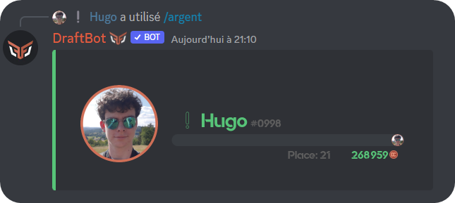
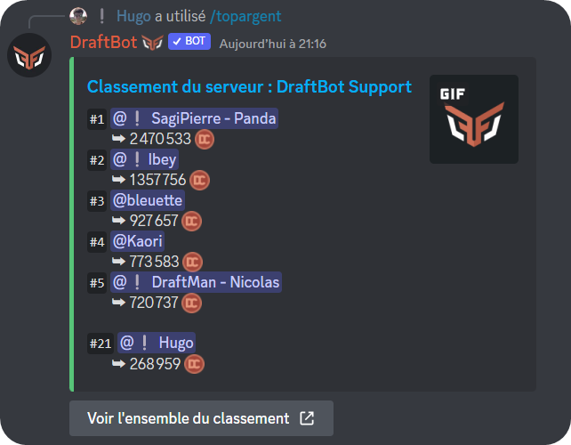
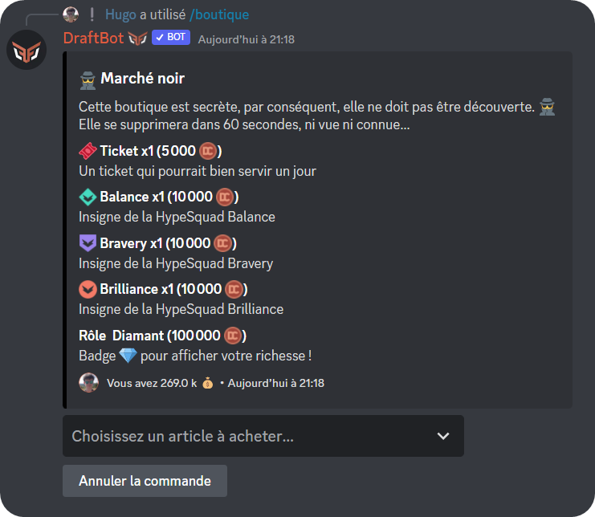

# Gestion de l'économie

### <mark style="color:purple;">Monnaie</mark>

Vous pouvez voir votre somme d'argent ainsi que celle des autres membres en indiquant leur pseudo sous "membre" avec <mark style="color:orange;">/argent \[membre]</mark>.\
Afin d'obtenir de l'argent, il faut que [le système d'économie](https://docs.draftbot.fr/slash/configuration/economie) soit activé sur le serveur.

### <mark style="color:purple;">Classement de monnaie</mark>

Grâce à la commande <mark style="color:orange;">/topargent</mark> vous avez accès au classement économique du serveur. Vous verrez uniquement les cinq premiers du serveur ainsi que votre position. Pour voir l'ensemble du classement, cliquez sur le bouton situé sous le message de **DraftBot**.

### <mark style="color:purple;">Boutique</mark>

La boutique est l'endroit où vous pouvez acheter les articles qui composeront votre inventaire *(voir ci-dessous)*.\
Vous pouvez y acheter un rôle (temporaire ou non), de l'expérience, un objet d'inventaire et plein d'autres choses ! Elle est accessible avec la commande <mark style="color:orange;">/boutique</mark>\.


Le marché noir est une variante de la boutique. La différence est que la boutique se supprimera au bout de 30 secondes, ni vu ni connu !


### <mark style="color:purple;">Objets d'inventaire</mark>

Vous avez la possibilité avec **DraftBot** de pouvoir animer la vie du serveur avec des objets d'inventaire. Une fois achetés ou gagnés, voici les possibilités que vous avez pour utiliser vos objets d'inventaire :
- <mark style="color:orange;">/item echanger</mark> : échanger un de ses objets d'inventaire avec la personne de votre choix
- <mark style="color:orange;">/item donner</mark> : donner un de ses objets d'inventaire à la personne de votre choix
- <mark style="color:orange;">/item drop</mark> : offrir un de ses items à la personne qui appuiera sur le bouton en premier
- <mark style="color:orange;">/item vendre</mark> : vendre un de ses objets d'inventaire à la personne de son choix
- <mark style="color:orange;">/concours créer item</mark> : faire gagner un item via un giveaway
- <mark style="color:orange;">/dropitem</mark> : offrir un item à la personne qui appuiera sur le bouton en premier


**Conseil :** si vous voulez illustrer vos objets d'inventaire et ne pas avoir que du texte, vous pouvez ajouter des émojis.\
*Exemple : "🍒 Cerises"*


### <mark style="color:purple;">Rôle booster</mark>

Tu peux, lors de [la configuration](https://docs.draftbot.fr/slash/configuration/economie), choisir un rôle booster.\
Quand une personne a un rôle booster, elle pourra gagner 1,5 / 2 / 2,5 ou 3 fois plus d'argent qu'un membre normal.
