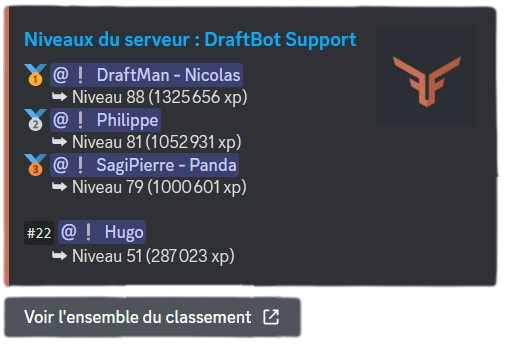

# Gestion des niveaux

## Configuration
Vous pouvez activer les niveaux, les désactiver, modifier leur intensité, ignorer des rôles et/ou des salons, les booster, les personnaliser ou encore les réinitialiser avec la commande <mark style="color:orange;">/config</mark>, en vous rendant ensuite dans l'onglet "Niveaux" du sélecteur.

Un message vous sera envoyé par **DraftBot** pour savoir si vous voulez configurer...
<!--
- Le système de niveaux
- Les récompenses de niveau
- L'annonce d'un nouveau niveau
- L'annonce d'une récompense gagnée -->

* ### Système de niveaux


* *Activer le système* : permet d'activer ou désactiver le système
* *Activer l'xp en vocal* : une fois activé, les membres pourront gagnés de l'xp en vocal (conditions : être plus de deux humains dans le salon vocal ; le salon vocal ne doit pas être paramétré comme "AFK") ***(premium)***
* *Niveau maximum* : permet de fixer un niveau maximal ne pouvant pas être dépassé par les membres une fois atteint ***(premium)***
* *Couleur* : paramétrer une couleur pour tout le système d'économie ***(premium)***
* *Ratio d'xp* : définir le nombre d'xp gagné par message
* *Rôles / Salons sans gain d'xp* : permet de ne pas donner d'xp à un membre s'il possède un certain rôle ou si il envoie son message dans un certain salon
* *Rôles / Salons boosters* : permet de donner plus d'xp à un membre s'il possède un certain rôle ou si il envoie son message dans un certain salon
* *Activer le reset des niveaux lors du départ* : une fois activé, les membres perdront tout leur xp s'ils quittent le serveur
* *Activer les longs messages comptent double xp* : une fois activé, les longs messages gagneront plus d'xp qu'à la normale
* *Activer le gain d'xp dans les threads* : permet de gagner ou non de l'xp dans les threads du serveur.


Afin de ne pas encourager le "farm d'xp", **DraftBot** ne donne de l'xp que pour les messages ayant été envoyés 30 secondes après le message précédent du membre.







Accéder au panel de DraftBot


Sur le panel, vous avez les mêmes possibilités de configuration que les slash commandes mais vous avez ici tout sur la même page.

Pour configurer le système de niveau, accédez au panel via le lien ci-dessus et rendez-vous dans la catégorie "Niveaux" sur le serveur de votre choix.




#### Autres commandes de configuration
Malgré toute la configuration via les slash commandes ou le panel, d'autres commandes sont également disponibles :
* *<mark style="color:orange;">/adminxp définir</mark>* : permet de définir le nombre d'xp ou de niveaux d'un membre
* *<mark style="color:orange;">/adminxp ajouter</mark>* : permet d'ajouter de l'xp ou des niveaux à un membre
* *<mark style="color:orange;">/adminxp réinitialiser server</mark>* : permet de réinitialiser l'xp et les niveaux de tous les membres du serveur
* *<mark style="color:orange;">/adminxp retirer</mark>* : permet de retirer de l'xp ou des niveaux à un membre


La commande *<mark style="color:orange;">/adminxp réinitialiser server</mark>* est irréversible : aucun moyen de revenir en arrière si vous vous trompez de membre.


* ### Les récompenses de niveau
#### Créer une récompense

#### Supprimer une récompense
> *Ajouter avec ici : Supprimer toutes les récompenses*

#### Afficher les récompenses

* ### Annonces
#### Nouveau niveau


Texte 1



Texte b



#### Récompense gagnée


Texte 2



Texte 2



## Afficher les niveaux

### Niveau
Vous pouvez voir votre niveau ainsi que celui des autres membres en indiquant leur pseudo sous "membre" avec <mark style="color:orange;">/niveau \[membre]</mark>.


Afin d'obtenir de l'xp et ainsi gagner en niveaux, il faut que le système de niveaux soit activé sur le serveur.


### Le classement du serveur
Grâce à la commande <mark style="color:orange;">/topniveau</mark> vous avez accès au classement des niveaux du serveur. Vous y verrez les cinq premiers membres ainsi que votre position. Pour voir l'ensemble du classement, cliquez sur le bouton situé sous le message de **DraftBot** ("Voir l'ensemble du classement").

