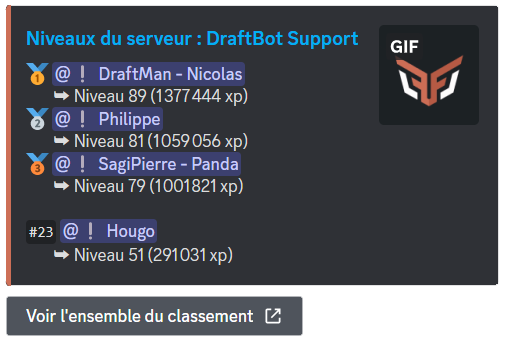

# Gestion des niveaux

## Votre niveau
Vous pouvez voir votre niveau, ainsi que celui des autres membres en indiquant leur pseudo dans l'argument "membre" avec <mark style="color:orange;">/niveau \[membre]</mark>.


Afin d'obtenir de l'expérience et ainsi gagner en niveaux, il faut que le système de niveaux soit activé sur le serveur.


## Classement du serveur
Grâce à la commande <mark style="color:orange;">/topniveau</mark>, vous avez accès au classement des niveaux du serveur. Vous y verrez les cinq premiers membres ainsi que votre position. Pour voir l'ensemble du classement, cliquez sur le bouton **"Voir l'ensemble du classement"** situé sous le message de **DraftBot**.

## Récompenses du serveur

Pour afficher les récompenses sur votre serveur, vous pouvez faire la commande <mark style="color:orange;">/recompenses</mark>.

## Gérer les niveaux des membres
Plusieurs commandes sont disponibles pour gérer l'expérience de vos membres :
* *<mark style="color:orange;">/adminxp définir</mark>* : Permet de définir le nombre d'expérience ou de niveaux d'un membre.
* *<mark style="color:orange;">/adminxp ajouter</mark>* : Permet d'ajouter de l'expérience ou des niveaux à un membre.
* *<mark style="color:orange;">/adminxp réinitialiser server</mark>* : Permet de réinitialiser l'expérience et les niveaux de tous les membres du serveur.
* *<mark style="color:orange;">/adminxp retirer</mark>* : Permet de retirer de l'expérience ou des niveaux à un membre.


La commande *<mark style="color:orange;">/adminxp réinitialiser serveur</mark>* est irréversible : il sera impossible d'annuler la réinitialisation et de redonner l'expérience à vos membres.


## Configuration
Vous pouvez activer les niveaux, les désactiver, modifier leur intensité, ignorer des rôles et/ou des salons, les booster, les personnaliser ou encore les réinitialiser avec la commande <mark style="color:orange;">/config</mark>, en vous rendant ensuite dans l'onglet "Niveaux" du sélecteur.

Un message vous sera envoyé par **DraftBot** pour savoir si vous voulez configurer :
* Le système de niveaux
* Les récompenses de niveau
* Les annonces d'un nouveau niveau
* Les annonces d'une récompense gagnée

*Retrouvez le détail de configuration de chacun de ces boutons ci-dessous.*

### Système de niveaux


* ***Activer le système*** ⇒ Permet d'activer ou désactiver le système.
* ***Activer l'xp en vocal*** ⇒ Une fois activé, les membres pourront gagner de l'expérience en vocal (conditions : être plus de deux humains dans le salon vocal ; le salon vocal ne doit pas être paramétré comme "AFK") ***(✨ premium)***.
* ***Niveau maximum*** ⇒ Permet de fixer un niveau maximal ne pouvant pas être dépassé par les membres une fois atteint ***(✨ premium)***.
* ***Couleur*** ⇒ Paramétrer une couleur pour tout le système d'économie ***(✨ premium)***.
* ***Ratio d'xp*** ⇒ Définir le nombre d'expérience gagnée par message.
* ***Rôles / Salons sans gain d'xp*** ⇒ Permet de ne pas donner d'expérience à un membre s'il possède un certain rôle ou si il envoie son message dans un certain salon.
* ***Rôles / Salons boosters*** ⇒ Permet de donner plus d'expérience à un membre s'il possède un certain rôle ou si il envoie son message dans un certain salon.
* ***Activer le reset des niveaux lors du départ*** ⇒ Une fois activé, les membres perdront toute leur expérience s'ils quittent le serveur.
* ***Activer les longs messages comptent double xp*** ⇒ Une fois activé, les longs messages gagneront plus d'expérience qu'à la normale.
* ***Activer le gain d'xp dans les threads*** ⇒ Permet de gagner ou non de l'expérience dans les threads du serveur.


Afin de ne pas encourager le "farm d'xp", **DraftBot** ne donne de l'expérience que pour les messages ayant été envoyés 30 secondes après le message précédent du membre.





[Accéder au panel de **DraftBot**](https://draftbot.fr/dashboard)

Sur le panel, vous retrouverez sur une même page, les mêmes possibilités de configuration qu'avec les commandes Slash sur Discord.

Pour configurer le système de niveau, accédez au panel via le lien ci-dessus et rendez-vous dans la catégorie "Niveaux" sur le serveur de votre choix.

> ⚠️ Une fois fini, n'oubliez pas d'enregistrer vos modifications avec le bouton "Enregistrer" en bas de la page.




### Récompenses de niveau


Pour créer une récompense, rendez-vous dans la catégorie "Niveaux" de la commande <mark style="color:orange;">/config</mark> puis appuyez sur "Récompenses de niveaux". 

Une fois fait, vous aurez accès au menu de création de récompenses :
* ***Créer*** ⇒ Créer une nouvelle récompense.
* ***Modifier*** ⇒ Modifier une récompense existante.
* ***Supprimer*** ⇒ Supprimer une récompense existante.
* ***Réinitialiser*** ⇒ Supprimer toutes les récompenses du serveur.

Le bouton "Réinitialiser" est irréversible : impossible d'annuler l'action et de recréer les récompenses du serveur.






Accéder au panel de **DraftBot**


Une fois sur le panel de **DraftBot** (accessible depuis le lien ci-dessus), rendez-vous en bas de la page "Niveaux".

Pour créer une récompense, appuyez sur le bouton **"Créer une récompense"** sur la droite de la page. Un pop-up s'ouvrira et vous proposera des champs à compléter en fonction de la récompense voulue : type de récompense à donner, niveau requis...

> ⚠️ Une fois fini, n'oubliez pas d'enregistrer vos modifications avec le bouton "Enregistrer" en bas de la page.




### Passages de niveaux


Pour configurer les annonces de passages de niveaux, rendez-vous dans la catégorie "Niveaux" de la commande <mark style="color:orange;">/config</mark> puis cliquez sur "Annonce d'un nouveau niveau".

Vous avez ensuite la possibilité de :
* ***Activer les annonces*** ⇒ Activer le système d'annonce des nouveaux niveaux.
* ***Salon*** ⇒ Choisir le salon dans lequel les annonces de nouveau niveau seront envoyées.
* ***Message personnalisé*** ⇒ Changer le message par défaut envoyé lors d'un passage de niveau.





Accéder au panel de **DraftBot**


Une fois sur le panel de **DraftBot** (accessible depuis le lien ci-dessus), rendez-vous en bas de la page "Niveaux".

Par défaut, le système est désactivé alors il faut l'activer en choisissant le mode d'envoi dans "Annonce d'un nouveau niveau".

Vous avez alors la possibilité de configurer le message d'annonce lors d'un passage de niveau dans le salon concerné ou dans un salon personnalisé.


Notez qu'il est possible de voir la liste des variables disponibles en entrant le caractère `{` dans la zone de texte.


> ⚠️ Une fois fini, n'oubliez pas d'enregistrer vos modifications avec le bouton "Enregistrer" en bas de la page.




### Réception de récompenses


Pour créer une annonce de nouveau niveau, rendez-vous dans la catégorie "Niveaux" de la commande <mark style="color:orange;">/config</mark> puis appuyez sur "Annonce d'une récompense".

Vous avez ensuite la possibilité de :
* ***Activer les annonces*** ⇒ Activer le système d'annonce de récompenses gagnées.
* ***Salon*** ⇒ Choisir le salon dans lequel les annonces de récompenses gagnées seront envoyées.
* ***Message personnalisé*** ⇒ Changer le message par défaut envoyé lors d'une récompense gagnée.





Accéder au panel de **DraftBot**


Une fois sur le panel de **DraftBot** (accessible depuis le lien ci-dessus), rendez-vous dans la page "Niveaux".

Par défaut, le système est désactivé alors il faut l'activer en choisissant le mode d'envoi dans "Annonce d'une récompense gagnée".

Vous avez alors la possibilité de configurer le message d'annonce pour la récompense gagnée dans le salon concerné ou dans un salon personnalisé.


Notez qu'il est possible de voir la liste des variables disponibles en entrant le caractère `{` dans la zone de texte.


> ⚠️ Une fois fini, n'oubliez pas d'enregistrer vos modifications avec le bouton "Enregistrer" en bas de la page.


